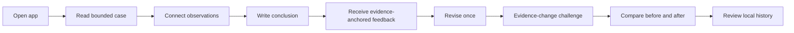
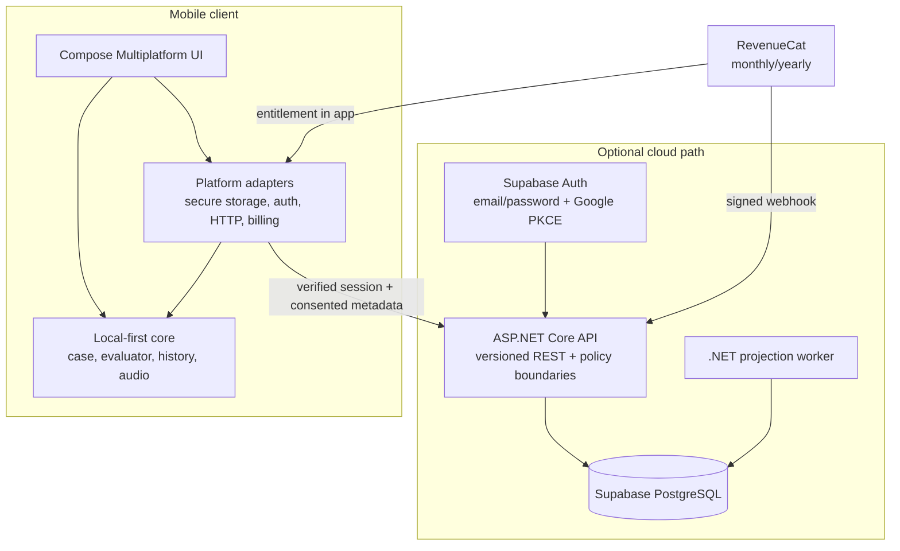

# Evidrilo

Evidrilo is a mobile learning app for practising how to turn observations into
clear, measurable conclusions that respect the limits of the available
evidence.

A learner reads a case, selects relevant evidence, writes a conclusion,
receives explainable feedback, makes one revision, and then tests how the
conclusion changes when one observation is no longer available.

> Status: **Source-first architecture verified locally through E189**. The
> reusable Kotlin boundaries for core, domain, application, data, features, and
> design-system are in place alongside the public repository shell.
> Device runtime, provider, deployment, human review, store, and submission
> gates remain separate and are not implied by source changes.

Current structural baseline: `13af4ec` — the approved source-first tree,
extracted Kotlin boundaries, categorized verification lanes, and the migrated
contract-schema test path are aligned while keeping the existing app task names
and public behavior. E189 also adds release-version regression coverage to the
local verifier.

[](https://kotlinlang.org/)
[](https://www.jetbrains.com/compose-multiplatform/)
[](https://developer.android.com/)
[](https://developer.apple.com/xcode/swiftui/)
[](https://dotnet.microsoft.com/apps/aspnet)
[](https://www.postgresql.org/)
[](https://www.revenuecat.com/)
[](https://docs.docker.com/compose/)
[](./LICENSE)

## Product flow



Evidrilo is intentionally bounded. The evaluator only assesses the
relationship between the goal, observations, limitations, and conclusion in
the supplied case. It is not a scientific-truth grader, academic marking
system, citation manager, safety advisor, or automatic answer generator.

## Product scope

| Area | Main features | Dependency |
| --- | --- | --- |
| Free learning | One synthetic case, fact/relation selection, conclusion, scope, limitation, next action, deterministic feedback, one revision, before/after comparison, evidence-change challenge, history, and reset/replay | Local only; no login, API, network, database, AI, or billing |
| Offline audio | Lightweight optional interaction sounds, offline TTS through platform adapters, accessible controls, lifecycle handling, and Android audio focus | Device voice/audio capability; never affects evaluation or persistence |
| Accounts | Email/password, recovery, session refresh, sign-out, account deletion, and Google OAuth authorization-code PKCE | Auth provider and device runtime still require verification |
| Sync | Progress metadata, cursor, retry, consent, idempotency, and conflict-safe boundaries | Verified login, API, and PostgreSQL; learner drafts remain local |
| Premium | Two additional cases through the `evidrilo_pro` entitlement, `monthly` and `yearly` packages, Paywall, and Customer Center | RevenueCat; lifetime is rejected fail-closed |
| Platform | Content reader, authoring/review/publish, analytics, progress, recommendation, AI safety boundary, cohort/membership, audit trail, and worker projections | Optional API and managed infrastructure |

The free core remains usable when login, API, RevenueCat, database, audio, or
network is unavailable. Premium access is never opened by a local flag; it is
derived from a valid entitlement.

## Tech stack

| Layer | Technology | Role |
| --- | --- | --- |
| Shared mobile | Kotlin Multiplatform **2.3.20** | Domain model, evaluator, state, persistence contract, network boundary, and most UI |
| UI | Compose Multiplatform **1.11.1** | Shared UI surface for Android, iOS, and the JVM walkthrough |
| Android | Android SDK, Kotlin Android, Android Gradle Plugin **8.13.2**, R8/resource shrinking | Android host, secure/platform adapters, and release packaging |
| iOS | Thin SwiftUI/Xcode host plus shared Kotlin/Native framework | iOS entry point and native platform integration |
| Billing | RevenueCat KMP **3.7.0** | Offerings, purchase, restore, entitlement, Paywall, Customer Center, and webhook boundary |
| API | C# with ASP.NET Core **.NET 10** | Versioned REST API, JWT/JWKS validation, authorization, rate limiting, error model, and health checks |
| Database | PostgreSQL **16** locally; Supabase managed PostgreSQL as the target | Migrations, RLS, sync feed, account/progress, content, billing projection, and audit data |
| Data access | Npgsql **10.0.0** | PostgreSQL access from the API and worker |
| Worker | .NET 10 hosted background worker | Projection rebuilds, lease fencing, retries, and bounded batch processing |
| Local operations | Docker, Docker Compose, and a versioned migration ledger | Reproducible API/worker/PostgreSQL development stack |
| Verification | Gradle tests, .NET tests, Node.js built-in test runner, and PostgreSQL smoke tests | Unit, contract, migration, integration, boundary, and packaging checks |

## Architecture



### Boundary principles

- The free learning loop is local-first and has no mandatory cloud dependency.
- Passwords are managed by the Auth provider; the Evidrilo API never receives
  or stores passwords.
- Sync carries only identifiers, revision metadata, cursors, and snapshot
  digests. Learner-authored conclusion drafts remain on the device for the
  competition scope.
- `evidrilo_pro` is the canonical entitlement. Only `monthly` and `yearly` are
  valid; `lifetime`, unknown products, and unverified states are rejected
  fail-closed.
- AI, if activated later, must remain optional, opt-in, non-grading, redacted,
  quota/timeout bounded, and unable to determine evaluator truth or premium
  access.
- The API and worker follow the database managed by the same migration ledger;
  every rollout and rollback must remain schema-compatible.

## Repository map

| Path | Responsibility |
| --- | --- |
| `modules/core` | Framework-neutral PKCE and platform secure-random primitives |
| `modules/domain` | Real multiplatform domain module: deterministic evaluator, reducers, feedback, and access identifiers |
| `modules/application` | Account/session, consented analytics, sync coordination, and recommendation orchestration |
| `modules/data` | Local persistence contracts, codecs, recovery, and platform storage adapters |
| `modules/features` | Feature presentation contracts for onboarding, guide, home, history, and disclosures |
| `modules/design-system` | Shared Compose visual tokens, components, icons, fonts, and reviewed assets |
| `apps/mobile-shared/src/commonMain` | Compose screen implementations, host wiring, content/audio/billing adapters, and free-core coordinator |
| `apps/mobile-shared/src/commonTest` | Cross-platform deterministic tests and regression boundaries |
| `apps/android` | Android host, manifest, secure storage, audio, HTTP, and release configuration |
| `apps/ios` | Xcode host, Info.plist, iOS configuration, and SwiftUI entry point |
| `contracts` | Versioned JSON contracts, schemas, and fixtures |
| `platform/Evidrilo.sln` | Solution boundary for the current API, worker, integration harness, and tests |
| `platform/api` | ASP.NET Core modular monolith API and storage adapters |
| `platform/database` | PostgreSQL/Supabase migrations, ledger, RLS, and integration smoke tests |
| `platform/worker` | Projection worker plus lease/retry handling |
| `infra` | Dockerfiles, local Compose, and explicit staging/production handoff boundaries; not a production deployment |
| `scripts` | Verification, release, public-package, asset, safety, and worktree checks |
| `tests` | Cross-boundary test indexes without duplicating executable owner tests |
| `tooling` | Formatting, lint, architecture-rule, and code-generation boundaries |
| `docs` | Public product, architecture, development, testing, release, API, ADR, and operations documentation |
| `internal` | Ignored/private design, research, audit, operations, and agent context |

## Quick start

### Requirements

- JDK 21 with both `java` and `javac`.
- Android SDK for Android builds.
- .NET 10 SDK for the API/worker lane.
- Docker Compose for the optional local platform stack.
- macOS and Xcode for running the iOS host.

The Gradle Wrapper is included; a global Gradle installation is not required.

### Source-only workspace

The repository is intentionally source-first. Android SDKs, JDKs, .NET SDKs,
Gradle state, NuGet packages, generated output, and private raw media should
live outside the public source package. UI design working files may be kept in
the ignored `internal/design/` workspace folder. The scripts use external
locations by default and accept these optional machine-local overrides:

```bash
export EVIDRILO_GRADLE_USER_HOME="$HOME/.cache/evidrilo/gradle"
export EVIDRILO_NUGET_PACKAGES="$HOME/.cache/evidrilo/nuget"
export EVIDRILO_DOTNET_ROOT="/opt/dotnet"
```

Set `EVIDRILO_JAVA_HOME` for a JDK 21 installation when the system `java` and
`javac` are not already JDK 21. Set `sdk.dir` in the ignored
`local.properties` file for the Android SDK. Existing repository-local
toolchains are compatibility fallbacks only; use
`EVIDRILO_ALLOW_REPOSITORY_TOOLCHAINS=1` explicitly while migrating an older
checkout.

The verification scripts do not create repository-local caches by default. This
working copy has completed the external-path migration: toolchains, caches,
generated output, and private raw media are preserved outside the checkout; UI
design sources are kept under ignored `internal/design/`. On an older checkout,
inspect those directories and move them only
after the external-path verification succeeds. See the
[development guide](docs/development/README.md#source-only-workspace) for the safe
sequence.

```bash
git clone https://github.com/AndroLay/evidrilo.git
cd evidrilo
cp local.properties.example local.properties
# Set sdk.dir in local.properties to the Android SDK location.

./gradlew :composeApp:jvmTest :composeApp:compileKotlinJvm
./gradlew :androidApp:assembleDebug
```

For the broader repository verification pass:

```bash
bash scripts/ci/verify-local.sh
```

The script runs the available Kotlin, Android, contract, migration, repository
boundary, deployment, API, worker, and asset lanes. A lane requiring a device,
macOS/Xcode, a provider account, or a managed service is not considered passed
merely because compilation succeeds.

### Run the API and database lanes

```bash
dotnet test platform/api.Tests/Evidrilo.Api.Tests.csproj
dotnet test platform/worker.Tests/Evidrilo.Worker.Tests.csproj --configuration Release
node --test contracts/contracts.test.mjs
node --test platform/database/migrations/migrations.test.mjs
```

Start the local API, worker, migration, and PostgreSQL stack:

```bash
bash scripts/verification/check-deployment.sh .
docker compose -f infra/environments/local/docker-compose.yml up --build -d
curl --fail http://127.0.0.1:5080/health/live
docker compose -f infra/environments/local/docker-compose.yml down
```

This Compose stack is development-only. Its PostgreSQL trust mode is limited to
the isolated local network and must not be used for staging or production.

### Run iOS

Open `apps/ios/iosApp.xcodeproj` in Xcode on macOS. Kotlin/Native compilation on
Linux does not prove that the iOS host launches, renders, or runs on a
simulator/device.

## Feature development

Use this sequence to keep shared code and boundaries consistent:

1. Define behavior in the shared domain and add a regression test in
   `commonTest`.
2. Add Compose state/reducer/UI coverage for happy, loading, error, empty,
   offline, cancellation, and retry states.
3. For OS capabilities, define an interface in the common source set and keep
   implementations small in `androidMain`/`iosMain`; do not bring native SDKs
   into the evaluator domain.
4. For API changes, update the contract/schema first, then migration, storage,
   authorization, endpoint, and integration tests.
5. For RevenueCat changes, preserve the monthly/yearly allowlist and cover
   active, pending, cancelled, failed, restored, revoked, unknown, and
   no-network states.
6. Run focused tests after a change and `scripts/ci/verify-local.sh` at the end of
   a batch. Document decisions and evidence only from results that were
   actually observed.

Primary working documents:

- [Development guide](docs/development/) — local toolchain and workflow.
- [Testing guide](docs/testing.md) — verification scope and limitations.
- [Architecture decision](docs/architecture/platform-decision.md) — why KMP,
  Compose, the API, and adapters were selected.
- [Repository structure](docs/architecture/repository-structure.md) —
  dependency direction and ownership.
- [RevenueCat boundary](docs/architecture/revenuecat.md) — entitlement and
  failure behavior.
- [Product contract](docs/product/m0-product-contract.md) — free-core rules.
- [Public operations boundary](docs/operations/README.md) — safe local versus
  owner-managed operational scope.

## Deployment target

Deployment has not been performed. The prepared target for staging and
production is:

| Component | Recommended target | Notes |
| --- | --- | --- |
| API | Render Web Service from `infra/docker/api.Dockerfile` | HTTPS, `/health/live`, environment secrets, and explicit CORS |
| Worker | Render Background Worker from `infra/docker/worker.Dockerfile` | No public traffic; runs projection jobs |
| Database + Auth | Separate Supabase managed projects for staging and production | PostgreSQL, Auth/JWKS, RLS, migration ledger, and backup/recovery plan |
| Billing callback | RevenueCat webhook to the HTTPS API | Secret/auth header remains in the secret store; server entitlement stays fail-closed |
| Local development | Docker Compose | Not a production security profile |

Render is the initial deployment recommendation because the existing API and
worker Dockerfiles map directly to web-service and background-worker services.
Supabase provides managed PostgreSQL/Auth so the team does not need to operate
the database on a VPS at the start. A VPS remains possible, but adds ownership
of TLS, firewalling, patching, backups, monitoring, recovery, and scaling.

Provider references: [Render Web Services](https://render.com/docs/web-services),
[Render Background Workers](https://render.com/docs/background-workers), and
[Supabase database connections](https://supabase.com/docs/guides/database/connecting-to-postgres).
Deployment, staging, managed backup/restore, and load-test status must not be
called verified until they are run in the owner's environment.

## Configuration and security

- `local.properties` stores Android machine configuration and is Git-ignored.
- Local iOS configuration uses ignored `.xcconfig` files; `*.example` files are
  templates only.
- The API starts from [`platform/api/.env.example`](platform/api/.env.example).
- The API and worker receive configuration through environment variables or a
  secret manager, never through Dockerfiles, source code, image layers, logs,
  fixtures, or the README.
- A RevenueCat public SDK key may be application configuration, but webhook
  secrets, database credentials, signing keys, access tokens, service-role keys,
  and provider payloads remain server-side and must not enter the repository.
- Before creating a public package, run:

```bash
bash scripts/github/export-public-package.sh . /path/to/empty-candidate
bash scripts/verification/check-public-package.sh /path/to/empty-candidate
```

In a checkout with valid Git metadata, also run
`bash scripts/security/check-github-safety.sh .` before committing or pushing. The
preparation workspace must not be treated as evidence that a push or public
publication has occurred.

## Status and evidence boundary

The current E189 repository phase has focused verification for the extracted
core, domain, application, data, features, and design-system boundaries,
release-version alignment, the public package, and worktree ownership. These
are repository-only checks. They do not prove device runtime, provider,
managed deployment, accessibility-service, human, or submission evidence.

The current structural phase has focused verification for the extracted domain,
shared JVM consumer, architecture boundaries, public-package checks, and
worktree ownership. These are repository-only checks. They do not prove device
runtime, provider transactions, managed deployment, human review, or
publication.

The main open gates are:

- Real Android/iOS runtime and TalkBack/VoiceOver accessibility review.
- RevenueCat Test Store price migration, transaction matrix, and real entitlement
  behavior.
- Managed Supabase, Google SSO, email delivery, staging, production API,
  managed backup/restore, monitoring, and load testing.
- Reviewer/participant validation, final assets, public repository, store
  release, and submission.

This README intentionally does not duplicate private audit chronology. Public
scope and durable decisions are maintained in the [roadmap](docs/roadmap.md)
and [decisions](docs/decisions.md). A local build or test proves only the
boundary that was run; it does not prove device runtime, provider transactions,
managed deployment, human review, or publication.

## Contributing

See [CONTRIBUTING.md](CONTRIBUTING.md). Changes must preserve the free core,
privacy boundaries, fail-closed entitlement, backward-compatible migrations,
and tests appropriate to the changed boundary.

## License

Evidrilo is released under the [MIT License](LICENSE).
