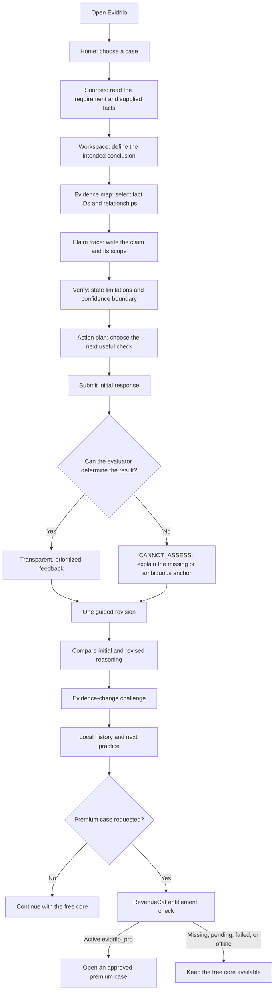
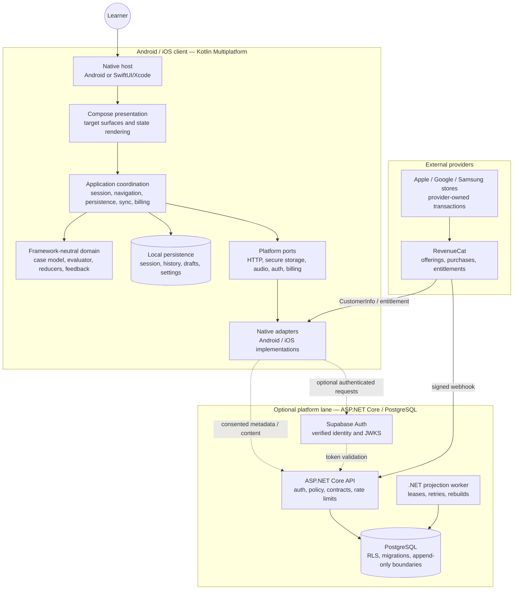
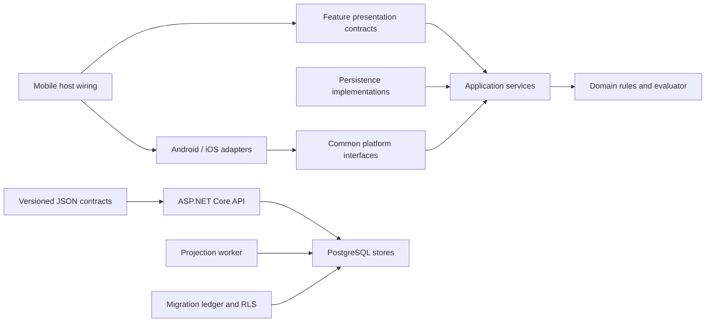
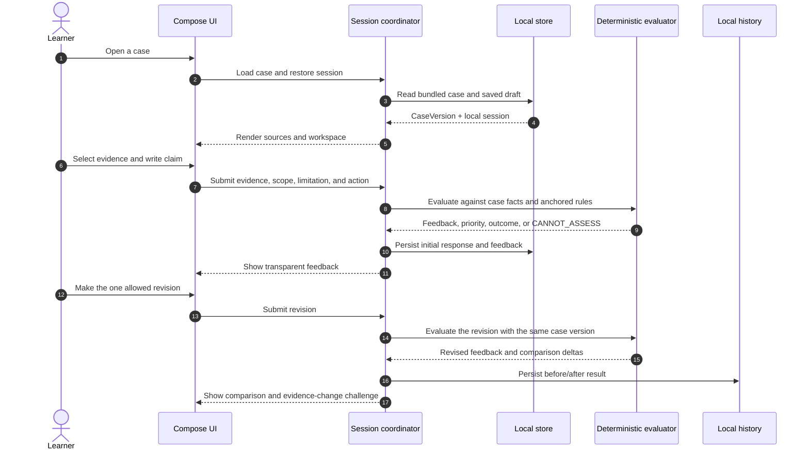
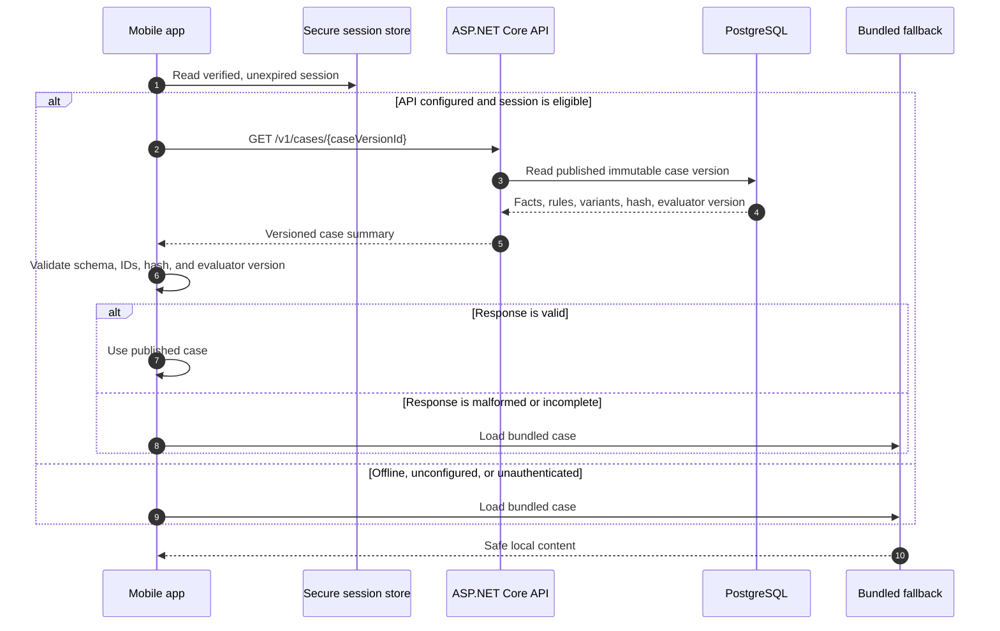
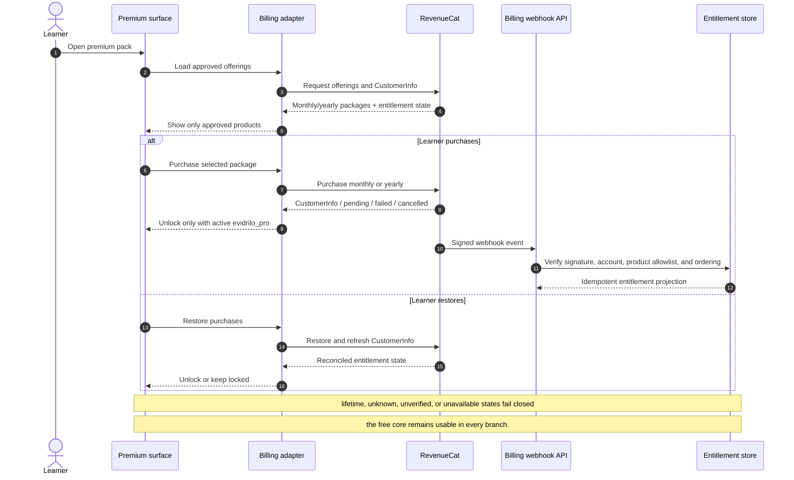
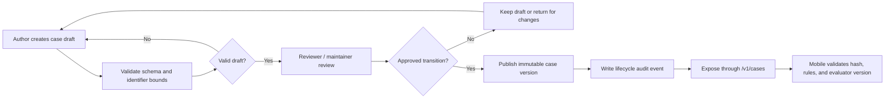
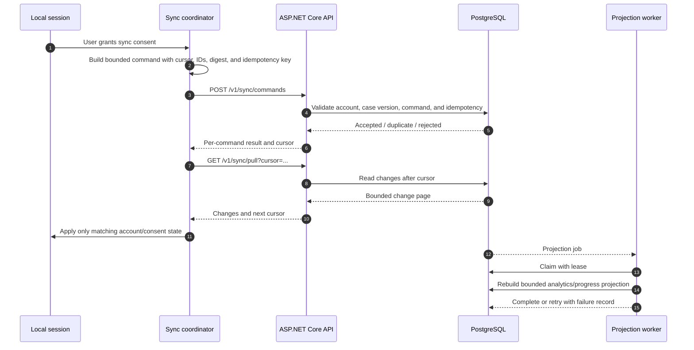

# Evidrilo

Evidrilo is a local-first evidence workspace for turning bounded observations
into clear, appropriately scoped conclusions.

It is no longer only a generic practice exercise. The product is being shaped
as an applied reasoning workspace that connects:

```text
Requirement → Evidence → Claim → Gap → Action → Revision → Verification
```

A learner opens a supplied case, reviews its source facts, maps evidence to a
claim, checks the claim boundary, chooses a next action, revises once, and
compares what changed. The system explains feedback from the case facts; it
does not pretend to be a scientific-truth grader or an automatic answer
generator.

## Current status

The current main branch contains the new Evidrilo product direction:

- target home, sources, workspace, evidence, claim-trace, verification,
  action-plan, profile, history, and evidence-change surfaces are routed from
  the primary mobile entry point;
- the deterministic conclusion engine, local persistence, one-revision rule,
  evidence-change challenge, and before/after history remain the product core;
- the ASP.NET Core API, PostgreSQL migrations, authoring lifecycle, evidence
  graph, sync, analytics, billing projection, and worker boundaries are
  implemented;
- monthly/yearly RevenueCat access, restore, retry, pending, cancellation, and
  fail-closed states are represented in the mobile boundary;
- the local Docker/PostgreSQL API-worker end-to-end smoke passes the billing,
  authoring, published-case, evidence-graph, sync, analytics, progress, and
  projection flows.

The current mobile experience still starts from the bundled `M0_T2` case so
the free core remains available offline. The next integration step is to make
the published-case API the preferred content source while retaining the local
case as a safe fallback.

The following are deliberately not claimed by this README until they are
observed: Android/iOS device runtime, TalkBack/VoiceOver review, RevenueCat
Test Store transactions, managed deployment, human validation, store release,
or final Shipaton submission evidence.

[](https://kotlinlang.org/)
[](https://www.jetbrains.com/compose-multiplatform/)
[](https://developer.android.com/)
[](https://developer.apple.com/xcode/swiftui/)
[](https://dotnet.microsoft.com/apps/aspnet)
[](https://www.postgresql.org/)
[](https://www.revenuecat.com/)
[](https://docs.docker.com/compose/)
[](./LICENSE)

## Contents

- [Why Evidrilo exists](#why-evidrilo-exists)
- [Who uses it](#who-uses-it)
- [Product flow](#product-flow)
- [Product scope](#product-scope)
- [Development direction](#development-direction)
- [Architecture](#architecture)
- [Data ownership](#data-ownership)
- [Contracts and invariants](#contracts-and-invariants)
- [API surface](#api-surface)
- [Repository map](#repository-map)
- [Quick start](#quick-start)
- [Development workflow](#development-workflow)
- [Deployment target](#deployment-target)
- [Configuration and security](#configuration-and-security)
- [Status and evidence boundary](#status-and-evidence-boundary)
- [Contributing](#contributing)
- [License](#license)

## Why Evidrilo exists

Many learning tools ask whether an answer is correct without showing how the
answer should be connected to the evidence available to the learner. Evidrilo
focuses on the smaller, more transferable skill underneath that problem:

> Can a learner make a claim that is supported by the available evidence,
> state its limits honestly, and choose a useful next action?

Evidrilo turns that question into a guided workspace. A case supplies a
bounded requirement, source facts, evidence references, limitations, and
feedback rules. The learner makes the reasoning explicit, receives feedback
anchored to those facts, revises once, and tests whether the conclusion still
holds when the evidence changes.

The product is deliberately not a scientific-truth grader, plagiarism checker,
academic marking system, citation manager, safety advisor, or general-purpose
AI answer generator. Its trust model is narrower: it only evaluates the
relationship between the learner's inputs and the case material that the
system can identify.

## Who uses it

| Actor | What they do | Current boundary |
| --- | --- | --- |
| Learner | Reads a case, selects evidence, writes a scoped conclusion, acts on feedback, and revises | The free learning loop is local-first and can run without an account or network after content is available |
| Account holder | Enables verified content access, consented progress metadata sync, billing identity, and optional recommendations | Account and sync are optional; learner-authored conclusion drafts stay on the device in the current product scope |
| Content author | Creates a case version with facts, rules, identifiers, and challenge variants | Server authoring lifecycle exists; a polished authoring UI is not claimed |
| Reviewer/maintainer | Reviews and transitions case versions and inspects lifecycle audit records | Role and API boundaries are implemented; editorial operations remain an external validation gate |
| Teacher/cohort viewer | Reads bounded cohort/progress summaries when authorized | API boundary exists; a full teacher dashboard is a post-submission product extension |
| Platform operator | Runs migrations, API/worker services, observability, backups, and provider configuration | Local Docker operations are reproducible; managed staging/production operations are not yet claimed |
| RevenueCat | Handles store offerings, purchases, CustomerInfo, restore, and signed billing webhooks | Provider and device transaction evidence still require owner-side verification |

## Product flow



The screens are views over one deterministic session state; they are not
disconnected mock screens. The active case supplies the facts and rules, the
shared evaluator produces the feedback, and local persistence restores the
session and comparison history. The UI must never invent a positive result
when the evaluator cannot find a valid fact anchor.

### The learner's minimum data model

```text
CaseVersion
├── requirement / objective
├── evidence references
├── facts (stable IDs and text)
├── limitations
├── feedback rules (fact anchors + outcome)
└── evidence-change variants

PracticeSession
├── selected evidence IDs
├── claim and claim scope
├── stated limitations
├── next action
├── initial response
├── feedback report
├── one revision
├── challenge result
└── before/after history entry
```

Every feedback item should answer three questions: **what did the learner
write**, **which supplied fact or rule supports this feedback**, and **what is
the smallest useful next change**. If those questions cannot be answered from
the active case, the evaluator abstains.

Evidrilo is intentionally bounded. The evaluator assesses only the relationship
between the requirement, observations, limitations, and conclusion in the
supplied case. It is not a scientific-truth grader, academic marking system,
citation manager, safety advisor, or automatic answer generator.

## Product scope

| Area | Current implementation | Forward direction |
| --- | --- | --- |
| Free evidence workspace | Bundled case, source facts, evidence selection, claim/scope/limitation/action inputs, deterministic feedback, one revision, evidence-change challenge, comparison history, reset, and replay | Make the published-case API the preferred source while preserving offline fallback |
| Visual product shell | Target home, sources, workspace, evidence map, claim trace, verification, action plan, profile, history, and contextual premium surfaces | Complete Android/iOS runtime review and refine against the approved visual direction |
| Offline audio | Optional interaction sounds, offline TTS adapters, accessible controls, lifecycle handling, and Android audio focus | Verify device behavior, naturalness, and accessibility on supported targets |
| Accounts | Email/password, recovery, session refresh, sign-out, account deletion, and Google OAuth authorization-code PKCE boundaries | Verify provider-backed auth and native redirect flows |
| Sync | Consent-gated progress metadata, cursor, retry, idempotency, conflict-safe boundaries, and local draft protection | Connect to managed staging and verify account/session behavior |
| Premium | Two additional cases through the `evidrilo_pro` entitlement, monthly/yearly packages, restore, retry, pending, cancellation, and fail-closed states | Verify RevenueCat Test Store transactions and localized store behavior |
| Platform | Published content reader, authoring/review/publish, evidence graph, analytics, progress, recommendation, AI safety boundary, cohort/membership, audit trail, and worker projections | Managed deployment, observability, editorial workflow, and production operations |

The free core remains usable when login, API, RevenueCat, database, audio, or
network is unavailable. Premium access is never opened by a local flag; it is
derived from a valid entitlement.

## Development direction

The project is intentionally delivered in layers:

1. **Now — applied local-first product:** finish the target mobile flow around
   the deterministic evidence graph, bundled content, local history, and
   transparent feedback.
2. **Next — connected content:** connect `PublishedCaseGateway` to the mobile
   entry point, validate the published-case schema, and keep a safe bundled
   fallback for offline use.
3. **Then — verified platform services:** complete Android/iOS runtime checks,
   RevenueCat Test Store evidence, consented sync, and human validation.
4. **After Shipaton — platform expansion:** add versioned content authoring,
   analytics-driven recommendations, optional AI explanations, and teacher or
   cohort workflows only when the underlying user need and privacy boundary
   are validated.

Cloud sync, AI, teacher dashboards, and production scaling are extensions of
the product—not substitutes for a reliable evidence workspace.

## Tech stack

| Layer | Technology | Role |
| --- | --- | --- |
| Shared mobile | Kotlin Multiplatform **2.3.20** | Domain model, evaluator, state, persistence contract, network boundary, and most UI |
| UI | Compose Multiplatform **1.11.1** | Shared UI surface for Android, iOS, and the JVM walkthrough |
| Android | Android SDK, Kotlin Android, Android Gradle Plugin **8.13.2**, R8/resource shrinking | Android host, secure/platform adapters, and release packaging |
| iOS | Thin SwiftUI/Xcode host plus shared Kotlin/Native framework | iOS entry point and native platform integration |
| Billing | RevenueCat KMP **3.7.0** | Offerings, purchase, restore, entitlement, Paywall, Customer Center, and webhook boundary |
| API | C# with ASP.NET Core **.NET 10** | Versioned REST API, JWT/JWKS validation, authorization, rate limiting, error model, and health checks |
| Database | PostgreSQL **16** locally; Supabase managed PostgreSQL as the target | Migrations, RLS, sync feed, account/progress, content, billing projection, and audit data |
| Data access | Npgsql **10.0.0** | PostgreSQL access from the API and worker |
| Worker | .NET 10 hosted background worker | Projection rebuilds, lease fencing, retries, and bounded batch processing |
| Local operations | Docker, Docker Compose, and a versioned migration ledger | Reproducible API/worker/PostgreSQL development stack |
| Verification | Gradle tests, .NET tests, Node.js built-in test runner, and PostgreSQL smoke tests | Unit, contract, migration, integration, boundary, and packaging checks |

## Architecture

Evidrilo uses a local-first, ports-and-adapters architecture. The shared
Kotlin code owns the learning rules and most of the presentation. Native hosts
provide operating-system capabilities. The optional platform lane owns
authenticated content, consented metadata, billing projections, analytics, and
editorial workflows.

The most important design rule is the direction of trust:

```text
Case facts and versioned rules → deterministic evaluator → learner-visible feedback
```

Network services, RevenueCat, and future AI assistance may enrich the product,
but they must not silently replace that chain.

### 1. Component view



The dotted arrows are optional runtime paths. The free core does not need them
to evaluate a bundled case, preserve a draft, or show local history.

### 2. Dependency direction

The repository keeps business rules below framework and provider code. A change
to RevenueCat, Supabase, Android, iOS, or HTTP should not require the evaluator
to know about that provider.



The arrows describe allowed dependency direction, not network calls. The
executable source of truth remains the module build files, contracts, and
architecture checks in the repository.

### 3. Free and offline practice flow

This is the core path and the most reliable demo path. It does not require an
account, an API, a database, or a purchase.



The evaluator does not infer truth from an arbitrary external source. It can
only return a determinate result when the input can be matched to the active
case's evidence IDs and rules. Otherwise it returns a bounded abstention with
an explanation of what is missing or ambiguous.

### 4. Connected published-case flow

The API and `PublishedCaseGateway` provide the connected path. The current
mobile entry point still defaults to bundled `M0_T2`; the connected path is
therefore a prepared boundary and the next integration step, not a claim that
remote content is already the default runtime source.



Published content is server-owned and versioned. A case is not partially
accepted: an invalid response is rejected, and the client keeps the safe local
path instead of evaluating against an unknown schema.

### 5. Premium and RevenueCat flow

RevenueCat is an adapter and monetization boundary, not part of the evaluator.
The mobile client reads an active `evidrilo_pro` entitlement. The server also
projects signed provider events independently so a client flag cannot grant
server access.



Approved product policy:

| Item | Policy |
| --- | --- |
| Entitlement | `evidrilo_pro` |
| Allowed packages | `monthly`, `yearly` |
| Lifetime package | Not part of the approved product plan; reject fail-closed |
| Mobile source of truth | Active entitlement from RevenueCat CustomerInfo |
| Server source of truth | Verified, ordered, idempotent RevenueCat webhook projection |
| Provider outage or cancellation | Keep free core; do not invent premium access |

### 6. Content authoring and publishing flow

Authoring is a controlled server workflow. Learners read only published case
versions; drafts and review transitions are not learner content.



The case schema carries stable fact IDs, feedback-rule anchors, limitations,
and evidence-change variants. This makes feedback inspectable and lets the
client reject a content document that cannot be evaluated safely.

### 7. Sync, analytics, and worker flow

Sync is consent-gated and intentionally redacted. The current competition
boundary keeps learner-authored draft text local; the platform receives only
the metadata needed for progress, analytics, and future recommendations.



### Data ownership

| Data | System of record | Mobile behavior | Server behavior |
| --- | --- | --- | --- |
| Bundled case | Versioned source in the app | Always available as a safe fallback | Not required for offline practice |
| Published case | PostgreSQL case version after review/publish | Read only after schema and hash validation | Immutable learner-facing version with lifecycle audit |
| Evaluator rules | Active case version + shared deterministic engine | Evaluates locally | API validates and serves versioned rules; it does not silently rewrite a learner result |
| Draft, initial response, revision | Device-local session store | Can be created, restored, reset, and compared offline | Not uploaded in the current competition sync boundary |
| Progress metadata | Local queue, then API after consent | Redacted, retryable, cursor-bound | Idempotent commands and bounded pull feed |
| Account identity | Supabase Auth provider | Secure session only; unverified sessions fail closed | API validates claims/JWKS and authorization |
| Entitlement | RevenueCat provider, projected server-side | CustomerInfo controls the premium surface | Signed webhook projection controls server access |
| Analytics/progress projection | PostgreSQL + worker projections | No local claim of server success | Server-owned writes and bounded rebuilds |
| AI assistance | No dependency in the core evaluator | Optional and disabled unless explicitly configured | Must be non-grading, redacted, bounded, and auditable if enabled |

### Failure and state model

| Condition | Safe behavior | What must not happen |
| --- | --- | --- |
| No network | Continue bundled free practice and local persistence | Do not show a fake remote success |
| Missing, expired, or unverified session | Defer authenticated content/sync/billing reads | Do not trust a caller-supplied account ID |
| Missing or malformed published case | Reject the response and use the local fallback | Do not evaluate against partial or unknown content |
| Evidence is insufficient or ambiguous | Return `CANNOT_ASSESS` with a bounded explanation | Do not guess a positive or negative truth result |
| Purchase pending, cancelled, failed, revoked, or provider unavailable | Keep premium locked and free core usable | Do not unlock from a local boolean flag |
| Duplicate or replayed sync command | Return an idempotent result | Do not duplicate progress or analytics events |
| Database not ready | Keep readiness false and expose a bounded error | Do not report the platform as ready before migrations |
| Worker lease lost or transient DB failure | Reclaim/retry through the worker policy | Do not create an unbounded duplicate projection |

### Boundary principles

- The free learning loop is local-first and has no mandatory cloud dependency.
- Passwords are managed by the Auth provider; the Evidrilo API never receives
  or stores passwords.
- Sync carries only identifiers, revision metadata, cursors, and snapshot
  digests. Learner-authored conclusion drafts remain on the device for the
  competition scope.
- `evidrilo_pro` is the canonical entitlement. Only `monthly` and `yearly` are
  valid; `lifetime`, unknown products, and unverified states are rejected
  fail-closed.
- AI, if activated later, must remain optional, opt-in, non-grading, redacted,
  quota/timeout bounded, and unable to determine evaluator truth or premium
  access.
- The API and worker follow the database managed by the same migration ledger;
  every rollout and rollback must remain schema-compatible.

## Contracts and invariants

These rules are more important than any individual screen or provider. They
are the constraints that keep Evidrilo explainable as the product grows.

### Case and evaluator invariants

1. A learner session evaluates exactly one identified `CaseVersion`.
2. Published case versions are immutable. A content change creates a new
   version, hash, and evaluator/content compatibility boundary.
3. Fact IDs, rule IDs, evidence references, and variant IDs are unique and
   bounded by the case schema.
4. Every determinate feedback item is anchored to facts or rules in the active
   case. Unknown, stale, contradictory, or ambiguous anchors are rejected or
   become `CANNOT_ASSESS`.
5. The same case version and learner input produce the same deterministic
   evaluator result. AI is not on this decision path.
6. The product records one initial response and one guided revision for the
   competition flow. Additional practice is a new session, not an overwrite of
   the previous reasoning.

### Identity, privacy, and sync invariants

1. A caller-supplied account ID never establishes identity. The API derives
   identity from a verified provider token.
2. A local session is usable anonymously. Authenticated content and sync are
   deferred when the session is missing, expired, unverified, or malformed.
3. Sync requires explicit consent, bounded commands, an idempotency key, and a
   cursor. Replays are safe and account-scoped.
4. Learner-authored conclusion text is not included in the current competition
   sync payload. Drafts remain recoverable on the device.
5. Passwords, access tokens, provider payloads, private research, reviewer
   contacts, and secrets never belong in the public repository.

### Billing and platform invariants

1. `evidrilo_pro` is the only premium entitlement accepted by the application
   boundary.
2. Only `monthly` and `yearly` products are allowed. Unknown or legacy product
   identifiers fail closed.
3. A provider callback is verified, bounded, account-scoped, ordered, and
   idempotent before it changes a server entitlement projection.
4. Purchase, restore, cancellation, expiry, revocation, pending, and provider
   outage states never disable the free core.
5. Database readiness requires the current migration ledger. The API and worker
   do not operate against an unverified schema.
6. Worker projections are lease-bound, retryable, and bounded; a lost lease
   cannot authorize an unbounded duplicate projection.

### Contract evolution rule

When a contract changes, update the versioned schema/fixture first, then the
producer and consumer, then the migration and integration tests. Do not make a
mobile or server release depend on an undocumented field that another version
cannot safely ignore. Record a durable decision in [`docs/decisions.md`](docs/decisions.md)
when the change affects privacy, identity, billing, content semantics, or
dependency direction.

## Repository map

| Path | Responsibility |
| --- | --- |
| `modules/core` | Framework-neutral PKCE and platform secure-random primitives |
| `modules/domain` | Real multiplatform domain module: deterministic evaluator, reducers, feedback, and access identifiers |
| `modules/application` | Account/session, consented analytics, sync coordination, and recommendation orchestration |
| `modules/data` | Local persistence contracts, codecs, recovery, and platform storage adapters |
| `modules/features` | Feature presentation contracts for onboarding, guide, home, history, and disclosures |
| `modules/design-system` | Shared Compose visual tokens, components, icons, fonts, and reviewed assets |
| `apps/mobile-shared/src/commonMain` | Compose screen implementations, host wiring, content/audio/billing adapters, and free-core coordinator |
| `apps/mobile-shared/src/commonTest` | Cross-platform deterministic tests and regression boundaries |
| `apps/android` | Android host, manifest, secure storage, audio, HTTP, and release configuration |
| `apps/ios` | Xcode host, Info.plist, iOS configuration, and SwiftUI entry point |
| `contracts` | Versioned JSON contracts, schemas, and fixtures |
| `platform/Evidrilo.sln` | Solution boundary for the current API, worker, integration harness, and tests |
| `platform/api` | ASP.NET Core modular monolith API and storage adapters |
| `platform/database` | PostgreSQL/Supabase migrations, ledger, RLS, and integration smoke tests |
| `platform/worker` | Projection worker plus lease/retry handling |
| `infra` | Dockerfiles, local Compose, and explicit staging/production handoff boundaries; not a production deployment |
| `scripts` | Verification, release, public-package, asset, safety, and worktree checks |
| `tests` | Cross-boundary test indexes without duplicating executable owner tests |
| `tooling` | Formatting, lint, architecture-rule, and code-generation boundaries |
| `docs` | Public product, architecture, development, testing, release, API, ADR, and operations documentation |
| `internal` | Ignored/private design, research, audit, operations, and agent context |

## API surface

The platform is a versioned REST boundary, not a second copy of the mobile
evaluator. Routes are authenticated and rate-limited where their policy
requires it; the webhook has its own signature and payload limits. The table
below is a map for contributors, not a replacement for the typed contracts and
endpoint tests.

| Capability | Current routes | Responsibility |
| --- | --- | --- |
| Health | `GET /health/live`, `GET /health/ready` | Process liveness and migration-aware database readiness |
| Published content | `GET /v1/cases`, `GET /v1/cases/{caseVersionId}` | List/read only published, versioned learner cases |
| Evidence graph | `GET /v1/cases/{caseVersionId}/evidence-graph` | Project validated case facts, anchors, and relationships for inspection |
| Authoring | `POST /v1/authoring/cases`, `POST /v1/authoring/cases/{caseVersionId}/transition`, `GET /v1/authoring/cases/{caseVersionId}/audit` | Create, review, publish, and audit case lifecycle transitions |
| Account | `GET /v1/account/me`, `DELETE /v1/account/me` | Read the verified account boundary and request guarded deletion |
| Sync | `POST /v1/sync/commands`, `GET /v1/sync/pull` | Consent-gated, cursor-based, idempotent metadata synchronization |
| Billing | `POST /v1/billing/webhook`, `GET /v1/billing/entitlements` | Verify provider events and read the server entitlement projection |
| Analytics | `POST /v1/analytics/events`, `GET /v1/progress/me`, `GET /v1/progress/daily` | Accept bounded events and expose server-derived progress summaries |
| Recommendations | `GET /v1/recommendations/next`, `POST /v1/recommendations/interactions` | Return deterministic, projection-backed next-practice suggestions and interactions |
| Cohorts and membership | `GET /v1/teacher/cohorts/{cohortId}/summary`, organization membership routes | Apply role-bound access to future teacher/cohort workflows |
| Optional AI assistance | `POST /v1/ai/assist` | Bounded, non-grading assistance boundary; not part of evaluator truth |

The API does not receive passwords. It validates provider-issued identity
claims, checks verified-account and role policy, validates request shape, and
delegates storage to bounded stores. A database outage is surfaced as an
explicit unavailable state rather than silently falling back to an in-memory
write path.

## Public package and private workspace

The public repository is intentionally smaller than the working checkout. It
contains the source needed to build and understand Evidrilo, while private
research and operational material stays outside the public package.

| Public and reproducible | Private or excluded |
| --- | --- |
| Kotlin, Swift host, C#, SQL migrations, contracts, synthetic fixtures, tests, Dockerfiles, scripts, architecture docs, product docs, `LICENSE`, and `CONTRIBUTING.md` | `internal/` research and audit chronology, raw participant/reviewer data, design working files, private video/source media, provider credentials, database secrets, signing material, generated output, caches, and machine toolchains |

Never solve a missing public artifact by copying the private workspace into the
repository. Use the explicit public exporter and package checks instead:

```bash
bash scripts/github/export-public-package.sh . /path/to/empty-candidate
bash scripts/verification/check-public-package.sh /path/to/empty-candidate
```

## Quick start

### Requirements

- JDK 21 with both `java` and `javac`.
- Android SDK for Android builds.
- .NET 10 SDK for the API/worker lane.
- Docker Compose for the optional local platform stack.
- macOS and Xcode for running the iOS host.

The Gradle Wrapper is included; a global Gradle installation is not required.

### Source-only workspace

The repository is intentionally source-first. Android SDKs, JDKs, .NET SDKs,
Gradle state, NuGet packages, generated output, and private raw media should
live outside the public source package. UI design working files may be kept in
the ignored `internal/design/` workspace folder. The scripts use external
locations by default and accept these optional machine-local overrides:

```bash
export EVIDRILO_GRADLE_USER_HOME="$HOME/.cache/evidrilo/gradle"
export EVIDRILO_NUGET_PACKAGES="$HOME/.cache/evidrilo/nuget"
export EVIDRILO_DOTNET_ROOT="/opt/dotnet"
```

Set `EVIDRILO_JAVA_HOME` for a JDK 21 installation when the system `java` and
`javac` are not already JDK 21. Set `sdk.dir` in the ignored
`local.properties` file for the Android SDK. Existing repository-local
toolchains are compatibility fallbacks only; use
`EVIDRILO_ALLOW_REPOSITORY_TOOLCHAINS=1` explicitly while migrating an older
checkout.

The verification scripts do not create repository-local caches by default. This
working copy has completed the external-path migration: toolchains, caches,
generated output, and private raw media are preserved outside the checkout; UI
design sources are kept under ignored `internal/design/`. On an older checkout,
inspect those directories and move them only
after the external-path verification succeeds. See the
[development guide](docs/development/README.md#source-only-workspace) for the safe
sequence.

```bash
git clone https://github.com/AndroLay/evidrilo.git
cd evidrilo
cp local.properties.example local.properties
# Set sdk.dir in local.properties to the Android SDK location.

./gradlew :composeApp:jvmTest :composeApp:compileKotlinJvm
./gradlew :androidApp:assembleDebug
```

For the broader repository verification pass:

```bash
bash scripts/ci/verify-local.sh
```

The script runs the available Kotlin, Android, contract, migration, repository
boundary, deployment, API, worker, and asset lanes. A lane requiring a device,
macOS/Xcode, a provider account, or a managed service is not considered passed
merely because compilation succeeds.

### Run the API and database lanes

```bash
dotnet test platform/api.Tests/Evidrilo.Api.Tests.csproj
dotnet test platform/worker.Tests/Evidrilo.Worker.Tests.csproj --configuration Release
node --test contracts/contracts.test.mjs
node --test platform/database/migrations/migrations.test.mjs
```

Start the local API, worker, migration, and PostgreSQL stack:

```bash
bash scripts/verification/check-deployment.sh .
docker compose -f infra/environments/local/docker-compose.yml up --build -d
curl --fail http://127.0.0.1:5080/health/live
docker compose -f infra/environments/local/docker-compose.yml down
```

This Compose stack is development-only. Its PostgreSQL trust mode is limited to
the isolated local network and must not be used for staging or production.

### Run iOS

Open `apps/ios/iosApp.xcodeproj` in Xcode on macOS. Kotlin/Native compilation on
Linux does not prove that the iOS host launches, renders, or runs on a
simulator/device.

## Development workflow

Use this sequence to keep shared code, contracts, and verification boundaries
consistent:

1. Define behavior in the shared domain and add a regression test in
   `commonTest`.
2. Add Compose state/reducer/UI coverage for happy, loading, error, empty,
   offline, cancellation, and retry states.
3. For OS capabilities, define an interface in the common source set and keep
   implementations small in `androidMain`/`iosMain`; do not bring native SDKs
   into the evaluator domain.
4. For API changes, update the contract/schema first, then migration, storage,
   authorization, endpoint, and integration tests.
5. For RevenueCat changes, preserve the monthly/yearly allowlist and cover
   active, pending, cancelled, failed, restored, revoked, unknown, and
   no-network states.
6. Run focused tests after a change and `scripts/ci/verify-local.sh` at the end of
   a batch. Document decisions and evidence only from results that were
   actually observed.

### Change ownership

| Change | First owner | Required review boundary |
| --- | --- | --- |
| Evaluator, case rules, reducer, or persistence codec | `modules/` and `apps/mobile-shared` | Common tests, adversarial fixtures, offline behavior, and compatibility review |
| Android/iOS capability | Platform source set and native host | Common interface first, then platform compile/runtime/accessibility checks |
| API behavior | `contracts/` then `platform/api` | Request validation, auth policy, storage, endpoint tests, and integration path |
| Database behavior | `platform/database/migrations` | Forward migration, checksum/ledger, RLS, rollback compatibility, and fresh-database smoke |
| Worker behavior | `platform/worker` | Lease, retry, bounded batch, projection, and failure-path tests |
| RevenueCat behavior | Mobile billing adapter plus server webhook boundary | Monthly/yearly allowlist, entitlement race tests, webhook signature/order tests, then provider Test Store evidence |
| Public documentation | `README.md` and `docs/` | No private paths, no secrets, no unobserved runtime/provider claims, and links that resolve |

### Verification matrix

| Gate | Command or evidence | Proves | Does not prove |
| --- | --- | --- | --- |
| Shared deterministic behavior | `./gradlew :composeApp:jvmTest` | Common evaluator, reducer, persistence, and billing-state behavior for the executed tests | Android/iOS rendering or device behavior |
| Android artifact | `./gradlew :androidApp:assembleDebug` | The configured Android source compiles and packages a debug artifact | A correct visual result, accessibility, release signing, or store upload |
| API and worker | `dotnet test ...` | Executed API/worker unit and integration contracts | Managed provider configuration or production traffic |
| Contract and migration | `node --test contracts/contracts.test.mjs` and migration tests | Versioned schemas, repository boundaries, and migration invariants | A managed Supabase replay unless that environment was actually run |
| Local platform E2E | Docker/PostgreSQL integration harness | API, database, billing webhook, content, sync, analytics, and worker boundaries in the isolated local stack | RevenueCat's real network, production secrets, or store transactions |
| Device/accessibility | Android emulator, iOS simulator/device, TalkBack, VoiceOver | Runtime rendering, interaction, lifecycle, and assistive technology behavior on the tested targets | Untested devices or future provider configurations |
| Provider validation | RevenueCat Test Store and managed staging | Real offering, purchase, restore, revoke, auth, and deployment behavior | Long-term revenue, retention, or production scale |
| Human validation | Reviewer and participant protocol | Whether learners understand the flow and whether feedback is useful | A guarantee of learning outcomes or competition results |

The repository uses evidence language intentionally: **implemented** means code
and focused checks exist; **verified** means the named command or environment
was actually run; **open** means an external gate remains. These terms are not
interchangeable.

Primary working documents:

- [Development guide](docs/development/) — local toolchain and workflow.
- [Testing guide](docs/testing.md) — verification scope and limitations.
- [Architecture decision](docs/architecture/platform-decision.md) — why KMP,
  Compose, the API, and adapters were selected.
- [Repository structure](docs/architecture/repository-structure.md) —
  dependency direction and ownership.
- [RevenueCat boundary](docs/architecture/revenuecat.md) — entitlement and
  failure behavior.
- [Product contract](docs/product/m0-product-contract.md) — free-core rules.
- [Public operations boundary](docs/operations/README.md) — safe local versus
  owner-managed operational scope.

## Deployment target

Deployment has not been performed. The prepared target for staging and
production is:

| Component | Recommended target | Notes |
| --- | --- | --- |
| API | Render Web Service from `infra/docker/api.Dockerfile` | HTTPS, `/health/live`, environment secrets, and explicit CORS |
| Worker | Render Background Worker from `infra/docker/worker.Dockerfile` | No public traffic; runs projection jobs |
| Database + Auth | Separate Supabase managed projects for staging and production | PostgreSQL, Auth/JWKS, RLS, migration ledger, and backup/recovery plan |
| Billing callback | RevenueCat webhook to the HTTPS API | Secret/auth header remains in the secret store; server entitlement stays fail-closed |
| Local development | Docker Compose | Not a production security profile |

Render is the initial deployment recommendation because the existing API and
worker Dockerfiles map directly to web-service and background-worker services.
Supabase provides managed PostgreSQL/Auth so the team does not need to operate
the database on a VPS at the start. A VPS remains possible, but adds ownership
of TLS, firewalling, patching, backups, monitoring, recovery, and scaling.

Provider references: [Render Web Services](https://render.com/docs/web-services),
[Render Background Workers](https://render.com/docs/background-workers), and
[Supabase database connections](https://supabase.com/docs/guides/database/connecting-to-postgres).
Deployment, staging, managed backup/restore, and load-test status must not be
called verified until they are run in the owner's environment.

## Configuration and security

- `local.properties` stores Android machine configuration and is Git-ignored.
- Local iOS configuration uses ignored `.xcconfig` files; `*.example` files are
  templates only.
- The API starts from [`platform/api/.env.example`](platform/api/.env.example).
- The API and worker receive configuration through environment variables or a
  secret manager, never through Dockerfiles, source code, image layers, logs,
  fixtures, or the README.
- A RevenueCat public SDK key may be application configuration, but webhook
  secrets, database credentials, signing keys, access tokens, service-role keys,
  and provider payloads remain server-side and must not enter the repository.
- Before creating a public package, run:

```bash
bash scripts/github/export-public-package.sh . /path/to/empty-candidate
bash scripts/verification/check-public-package.sh /path/to/empty-candidate
```

In a checkout with valid Git metadata, also run
`bash scripts/security/check-github-safety.sh .` before committing or pushing. The
preparation workspace must not be treated as evidence that a push or public
publication has occurred.

## Status and evidence boundary

The current repository evidence is split between implementation, integration,
and external gates. This distinction is intentional.

### Verified locally

- API tests: `187/187` passed.
- Worker tests: `5/5` passed.
- Billing-focused API tests: `19/19` passed.
- Versioned contract, migration, deployment, architecture, public-package, and
  worktree-scope checks passed.
- Docker/PostgreSQL API-worker E2E passed through invalid billing signature,
  accepted and replayed billing events, entitlement isolation, authoring
  lifecycle, published-case reads, evidence graph reads, draft protection,
  sync, analytics, progress, and worker projection.
- The primary mobile route points to the new target surfaces, and the old
  visual route names are no longer used by the runtime source.

### Still open

- Published-case content is not yet the default mobile source; the bundled case
  remains the offline-first default.
- Real Android/iOS runtime and TalkBack/VoiceOver accessibility review.
- Kotlin/Gradle build verification in the current environment and native
  device/simulator evidence.
- RevenueCat Test Store catalog, transaction matrix, restore behavior, and
  real entitlement behavior.
- Managed Supabase, Google SSO, email delivery, staging, production API,
  managed backup/restore, monitoring, and load testing.
- Two reviewer preflights, participant validation, final assets, public
  repository review, and Shipaton submission packaging.

This README intentionally does not duplicate private audit chronology. Public
scope and durable decisions are maintained in the [roadmap](docs/roadmap.md),
[decisions](docs/decisions.md), and the linked architecture/product guides. A
local build or test proves only the boundary that was run; it does not prove
device runtime, provider transactions, managed deployment, human review, or
publication.

## Contributing

See [CONTRIBUTING.md](CONTRIBUTING.md). Changes must preserve the free core,
privacy boundaries, fail-closed entitlement, backward-compatible migrations,
and tests appropriate to the changed boundary.

## License

Evidrilo is released under the [MIT License](LICENSE).
