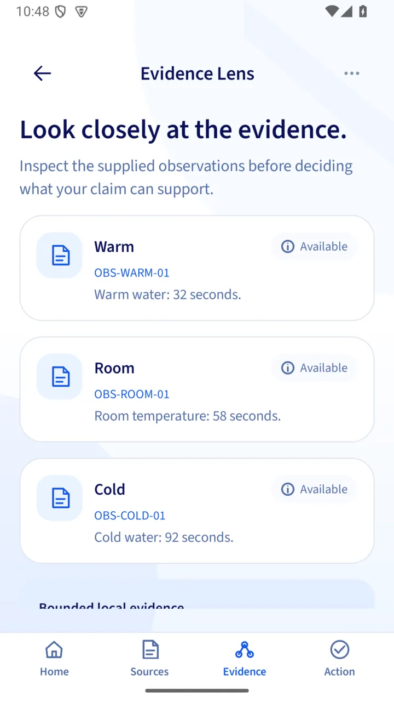
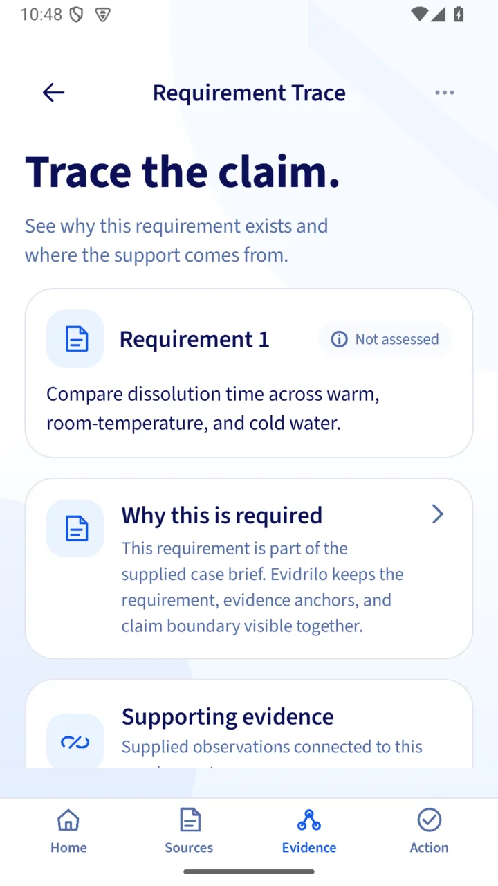
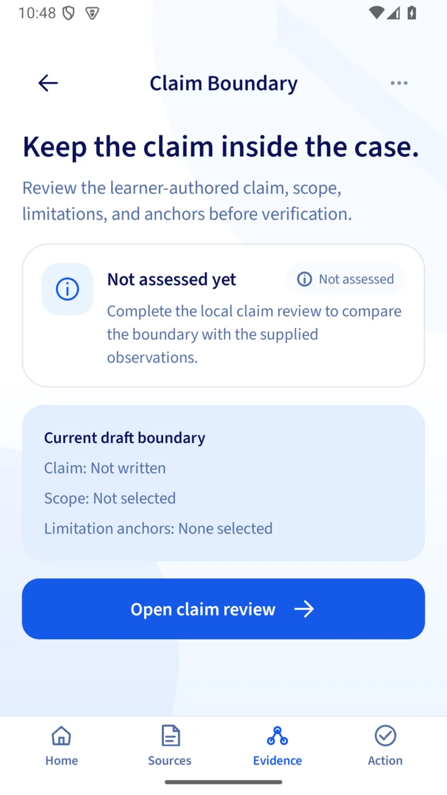
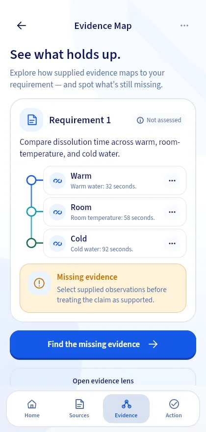
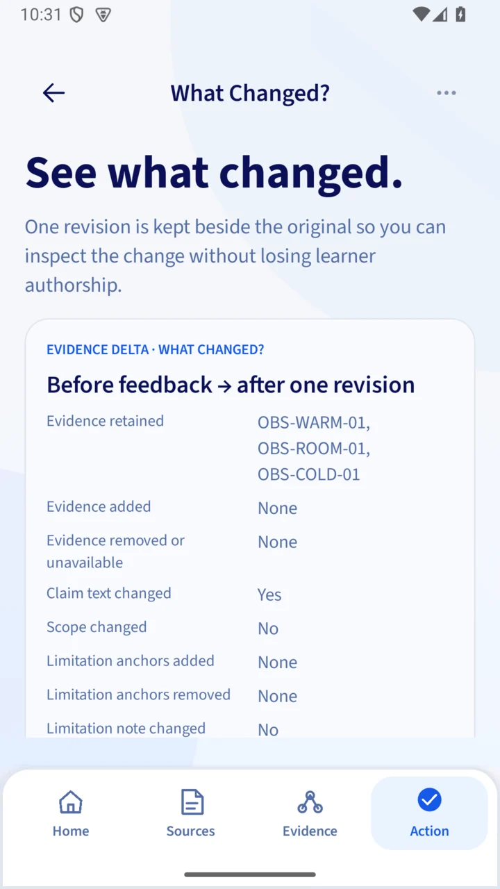

# Evidrilo

**From a research task to a claim whose evidence and limits stay in view.**

Evidrilo is a student research workspace. It connects a project brief, sources,
evidence notes, findings, claims, limitations, and next steps so students can
inspect the reasoning behind their work.

Students can organize their own local project or practice separately with a
bundled synthetic case. The case is not a project template and does not fill in
a student's research.

[](https://kotlinlang.org/)
[](https://www.jetbrains.com/compose-multiplatform/)
[](https://dotnet.microsoft.com/)
[](https://www.revenuecat.com/)
[](LICENSE)

[Features](#features) · [Landing page](apps/landing/README.md) · [Quick start](#quick-start) ·
[Architecture](docs/architecture/repository-structure.md) · [System flows](docs/architecture/system-execution-flows.md) ·
[Workflows](docs/product/workflows.md) · [Documentation](docs/README.md)

## Why Evidrilo

Academic work is spread across assignment instructions, source notes, analysis,
and the final conclusion. Evidrilo keeps the path visible: what the task asks,
which material supports a finding, how far a claim can go, what remains
uncertain, and what to do next.

Students choose and assess their own sources and write their own conclusions.
Evidrilo is not a source-discovery service, citation verifier, plagiarism
checker, academic grader, or scientific-truth oracle.

## Features

### Student Project Workspace

Start with a blank project and your brief. Add sources, evidence notes, and
findings; connect them to synthesis themes and claims, then record limits and
next steps. This first path focuses on directed literature synthesis and stays
local; signing in does not upload or merge project data.

[Project workflow and lifecycle →](docs/product/workflows.md)

### Guided Case Practice

These Android screenshots show the separate, sign-in-gated M0 tablet-dissolution
case. Its supplied observations are synthetic, not student projects or research
submissions. Feedback is deterministic and bounded to the case.

<table>
  <tr>
    <td align="center" valign="top" width="33%">
      <strong>Evidence Lens</strong><br>
      <a href="apps/landing/assets/evidence-lens.webp"></a>
      <p>Inspect the three supplied observations and select which ones support the comparison you want to make.</p>
      <a href="docs/product/workflows.md">Case workflow →</a>
    </td>
    <td align="center" valign="top" width="33%">
      <strong>Requirement Trace</strong><br>
      <a href="apps/landing/assets/requirement-trace.webp"></a>
      <p>Follow the task from its requirement to the observations that can support it.</p>
      <a href="docs/product/workflows.md">Case workflow →</a>
    </td>
    <td align="center" valign="top" width="33%">
      <strong>Claim Boundary</strong><br>
      <a href="apps/landing/assets/claim-boundary.webp"></a>
      <p>Keep a learner-written claim, its scope, and its limitations visible before verification.</p>
      <a href="docs/product/workflows.md">Case workflow →</a>
    </td>
  </tr>
</table>

<table>
  <tr>
    <td align="center" valign="top" width="50%">
      <strong>Evidence Map</strong><br>
      <a href="apps/landing/assets/evidence-map.webp"></a>
      <p>See how supplied facts connect to a requirement and where support is still missing.</p>
      <a href="docs/product/workflows.md">Evidence mapping →</a>
    </td>
    <td align="center" valign="top" width="50%">
      <strong>Evidence Delta · What Changed?</strong><br>
      <a href="apps/landing/assets/what-changed.webp"></a>
      <p>Compare the original with one learner-authored revision and inspect what changed.</p>
      <a href="docs/product/workflows.md">Revision workflow →</a>
    </td>
  </tr>
</table>

### Project Files and Portability

Generate Markdown, PDF, DOCX, and structured CSV reports, or exchange a versioned
`.evproj` archive with validation and preview before writing. Source and test
coverage exists; device save/reopen and picker acceptance remain open.

[Project and file workflows →](docs/product/workflows.md)

### Project Lifecycle and History

Autosave and revision checkpoints help preserve a student's work while they
develop it. Projects can be completed, archived, moved to Trash, or restored;
Free/Pro active-project limits are applied per installation.

[Project lifecycle and history →](docs/product/workflows.md)

### Deadlines and Local Reminders

Add a due date and schedule a local reminder to keep the next step visible.
Permission and cancellation flows are in source; delivery across restarts and
project/account changes still needs device acceptance.

[Reminder and notification flows →](docs/product/workflows.md)

### Reviewed Template Catalog

The API and authoring workflow support draft, review, approval, and publication.
Students only see selectable content after it has passed human/domain review;
there is currently no reviewed template available in the catalog.

[Catalog workstream →](docs/roadmap.md)

### Bounded AI Assistance

AI is designed to offer contextual suggestions for student review. Provider,
privacy, and credit gates remain closed, so live project generation is disabled;
deterministic checks retain authority over case feedback.

[AI assistance boundary →](docs/decisions.md#d-106-use-an-evidence-grounded-ai-loop-for-project-assistance)

### Accounts and Evidrilo Pro

Local project work does not require sign-in and is not uploaded when a user
signs in. Account and entitlement handling are in source; identity-provider
runtime and RevenueCat purchase, cancellation, restore, revoke, and expiry need
provider/device verification.

[RevenueCat architecture →](docs/architecture/revenuecat.md)

### API and Background Worker

The ASP.NET Core API, PostgreSQL migrations, and bounded .NET worker provide a
local platform foundation for versioned contracts and account-bound services.
RevenueCat billing events use idempotent webhook projections; these local
contracts do not establish a live provider transaction or managed deployment.
Local integration is separate from a hosted production deployment.

[Platform architecture →](docs/architecture/repository-structure.md) · [API docs →](docs/api/README.md)

### Static Landing Page

Responsive vanilla HTML/CSS/JavaScript site with a project-first story, an interactive synthetic-case walkthrough, and a five-question FAQ. [Landing guide →](apps/landing/README.md)
Preview with `python3 -m http.server 8000 --directory apps/landing`; replace the README screenshot gallery with a WebM walkthrough when the demo is recorded.

## Quick start

### Requirements

- JDK 21 with `java` and `javac`;
- Android SDK for Android builds;
- .NET 10 SDK and Node.js for API, worker, and contract checks;
- Docker Compose for the local platform stack;
- macOS and Xcode for running the iOS host.

The Gradle Wrapper is included; a global Gradle installation is not required.

### Mobile and shared tests

```bash
git clone https://github.com/AndroLay/evidrilo.git
cd evidrilo
cp local.properties.example local.properties
# Set sdk.dir in local.properties to the Android SDK location.

./gradlew :composeApp:jvmTest :composeApp:compileKotlinJvm
./gradlew :androidApp:assembleDebug
```

### API, worker, and contracts

```bash
dotnet test platform/api.Tests/Evidrilo.Api.Tests.csproj
dotnet test platform/worker.Tests/Evidrilo.Worker.Tests.csproj --configuration Release
node --test contracts/contracts.test.mjs
node --test platform/database/migrations/migrations.test.mjs
```

### Local platform stack

```bash
bash scripts/verification/check-deployment.sh .
docker compose -f infra/environments/local/docker-compose.yml up --build -d
curl --fail http://127.0.0.1:5080/health/live
docker compose -f infra/environments/local/docker-compose.yml down
```

The local PostgreSQL trust mode is development-only. Keep SDKs, caches, NuGet
packages, generated output, and private media outside a source-only checkout.
For iOS, open `apps/ios/iosApp.xcodeproj` in Xcode on macOS; Linux compilation
does not prove simulator/device behavior. See the [development guide](docs/development/README.md)
for overrides and more checks.

## Verification: what each check proves

| Check | Proves | Does not prove |
| --- | --- | --- |
| Common/JVM tests | Behavior covered by the tests that ran | Android/iOS rendering or device behavior |
| Android build | Android sources compile and package | Visual quality, accessibility, signing, or store upload |
| .NET, contract, database tests | API/worker/migration contracts in tested environments | Managed provider or production traffic |
| Architecture and package checks | Public boundary, dependency rules, and artifact protection | Human review or final publication |
| Emulator/simulator and accessibility review | Runtime on the tested targets | Untested devices and provider configurations |
| RevenueCat Test Store and staging | Behavior observed in those environments | Long-term revenue, retention, or scale |
| Human validation | Learner understanding of the flow and feedback | Guaranteed learning outcomes or competition results |

Use focused checks during development and run the full local verification
script for a release candidate:

```bash
bash scripts/ci/verify-local.sh
```

## Tech stack

The mobile app is built with Kotlin Multiplatform and Compose Multiplatform;
the optional platform API uses ASP.NET Core/.NET 10 with PostgreSQL.

| Layer | Technology | Responsibility |
| --- | --- | --- |
| Shared mobile | Kotlin Multiplatform 2.3.20 | Domain, evaluator, state, persistence contracts, and network boundary |
| Shared UI | Compose Multiplatform 1.11.1 | Android/iOS presentation and JVM walkthrough |
| Native hosts | Android SDK/API 35; SwiftUI/Xcode | Lifecycle, secure storage, audio, HTTP, and packaging |
| Billing | RevenueCat KMP 3.7.0 | Offerings, purchase/restore boundary, entitlements, and paywall integration |
| API | ASP.NET Core / .NET 10 | Versioned REST, verified-auth policy, rate limits, and health checks |
| Data | PostgreSQL 16 / Npgsql 10.0 | Content, accounts, projections, and audit persistence |
| Worker | .NET 10 hosted worker | Bounded background processing, retries, and projections |
| Local operations | Docker Compose and migration ledger | Reproducible local API/worker/PostgreSQL stack |
| Landing page | Vanilla HTML/CSS/JavaScript | Responsive static site and interactive synthetic-case walkthrough |

## Repository map

| Path | Responsibility |
| --- | --- |
| `apps/mobile-shared` | Compose screens, coordinator, content/audio/billing adapters, shared tests |
| `apps/android` | Android host, manifest, and platform configuration |
| `apps/ios` | Xcode host, SwiftUI entry point, and iOS configuration |
| `apps/landing` | Static landing page and curated synthetic-case screenshots |
| `modules/core` | Cross-cutting shared primitives |
| `modules/domain` | Framework-neutral case/project models, evaluator, reducers, feedback |
| `modules/application` | Account/session, consent, sync, analytics, recommendation, AI orchestration |
| `modules/data` | Persistence contracts, codecs, recovery, storage adapters |
| `modules/features` | Feature presentation contracts and user-facing state |
| `modules/design-system` | Visual tokens, components, icons, fonts, reviewed assets |
| `contracts` | Versioned JSON schemas, route manifests, synthetic fixtures |
| `platform/api` | ASP.NET Core API, authentication, authorization, server operations |
| `platform/worker` | Bounded .NET background processing |
| `platform/database` | PostgreSQL migrations and local database integration |
| `platform/integration` | Local API/worker integration harness |
| `infra` | Docker Compose, Dockerfiles, deployment handoff boundaries |
| `scripts` | Verification, safety, packaging, asset, architecture checks |
| `tests` / `tooling` | Cross-boundary test assets and repository tools/configuration |
| `docs` | Product, workflow, architecture, development, testing, release guides |
| `examples` | Synthetic examples only |
| `internal` / `audit` | Owner-local research and evidence; private and excluded from public packages |

## Contracts and safety rules

- A session evaluates one identified `CaseVersion`; published versions are immutable.
- Feedback anchors active-case facts or rules; stale or ambiguous inputs reject or return `CANNOT_ASSESS`.
- The same case version and input produce the same result. AI never decides truth; M0 allows one revision.
- Verified provider claims establish API identity; client-supplied account IDs do not.
- Sync requires consent, bounded commands, idempotency, and a cursor; sign-in alone does not upload projects.
- Keep credentials, provider payloads, private research/reviewer data, and generated output out of the public repo.

See the [product contract](docs/product/m0-product-contract.md),
[architecture](docs/architecture/repository-structure.md), and
[decisions](docs/decisions.md) for the detailed rules.

## Public repository boundary

The public package contains source, contracts, synthetic fixtures, tests,
scripts, and public documentation. It excludes private research/reviewer data,
design files, credentials, database secrets, signing material, generated output,
caches, and private media.

```bash
bash scripts/github/export-public-package.sh . /path/to/empty-candidate
bash scripts/verification/check-public-package.sh /path/to/empty-candidate
bash scripts/security/check-github-safety.sh .
```

A clean workspace does not prove that a public package, provider transaction,
or production deployment has been verified.

## Documentation, contribution, and license

- [Product workflows and diagrams](docs/product/workflows.md)
- [Architecture and repository structure](docs/architecture/repository-structure.md)
- [System execution flows and diagrams](docs/architecture/system-execution-flows.md)
- [RevenueCat architecture](docs/architecture/revenuecat.md)
- [AI assistance architecture](docs/decisions.md#d-106-use-an-evidence-grounded-ai-loop-for-project-assistance)
- [Development](docs/development/README.md) · [Testing](docs/testing.md) · [Release](docs/release.md)
- [Roadmap](docs/roadmap.md) · [Decisions](docs/decisions.md) · [API docs](docs/api/README.md)

See [CONTRIBUTING.md](CONTRIBUTING.md) to contribute. For public review,
publish this as a public open-source repository with a license; this source
uses the [MIT License](LICENSE), and third-party notices are in
[THIRD_PARTY_NOTICES.md](THIRD_PARTY_NOTICES.md).
