# System Architecture and Execution Flows

Observed deployment/device status: [1 October acceptance snapshot](../development/current-status.md).
Default-off and reviewed-template gates below describe source/configuration
boundaries; hosted general chat is enabled in the approved Staging runtime.

This guide shows how Evidrilo components exchange data at runtime. It
complements the student-facing journeys in
[`../product/workflows.md`](../product/workflows.md), which describe choices and
screens rather than component-to-component calls.

## Status and diagram conventions

| Label | Meaning |
| --- | --- |
| **Current** | The corresponding interaction exists in source. This does not prove a device, provider, or hosted run. |
| **Gated** | The contract or code exists, but configuration, content, UI, approval, or runtime acceptance is still missing. |
| **Target** | An accepted design direction that is not established as an available path. |

Solid arrows show an implemented boundary. Dashed arrows show an optional,
unwired, or gated boundary. A diagram is an architecture aid, not runtime
evidence.

## 1. System context

**Current architecture:** the mobile app owns offline learning and local
projects. The API and worker provide account-backed capabilities in source;
when `TEMPORARY_GUEST_MODE_ENABLED` is true, D-129 pauses server AI, cloud sync,
and analytics transmission. The current mobile constant is false, but each
account-backed capability still requires its own authentication, consent, and
provider gates. RevenueCat Pro is independently available to signed-in
accounts after provider identity is confirmed. The project editor never
automatically synchronizes local projects.

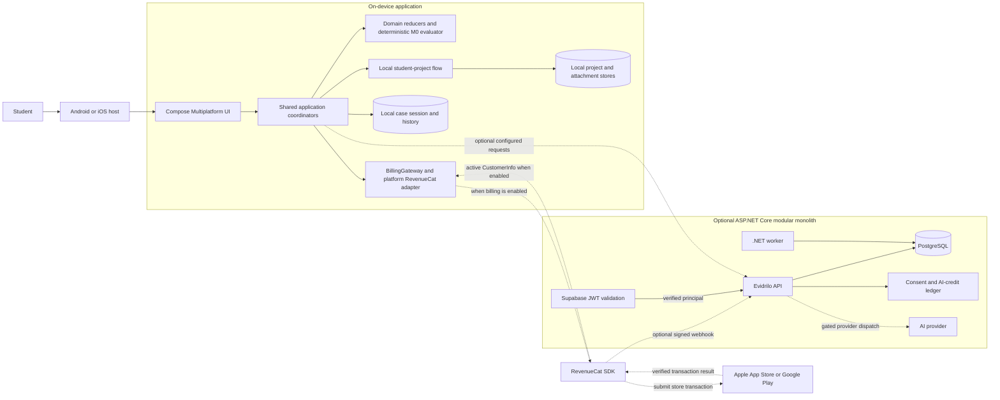

The local M0 evaluator remains authoritative for case feedback. Pro is enabled
independently from temporary local guest mode by D-131. The client identifies
the signed-in Evidrilo account before requesting offers, purchases, or restores;
only active matching RevenueCat `CustomerInfo` is the local Pro-access
authority, and the optional webhook projection does not unlock local content.
Provider configuration and runtime acceptance remain open. Public read-only
catalog requests may still use the network. D-129 pauses account-backed mobile
services only while the temporary guest flag is enabled; the current source
flag is false, but server AI remains default-off. The API's student-project
routes are separate server-owned records and are not wired to the local mobile
project editor.

## 2. Data ownership and trust boundaries

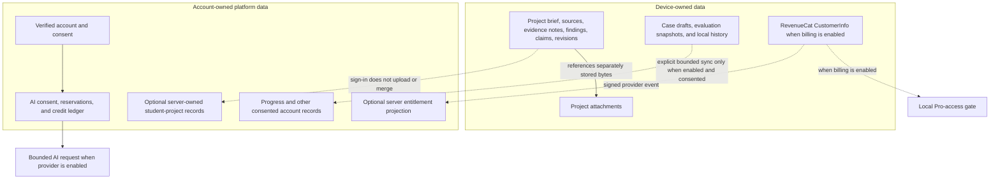

Project source records and evidence notes are student-entered; an attachment is
not automatically parsed into evidence. The server-owned project API has
ownership checks and versioned records, but it is not cloud sync for the
device-owned editor. Sign-in alone does not move local data.

## 3. Local development topology

**Current:** Docker Compose runs a reproducible development stack. It does not
represent a hosted deployment.

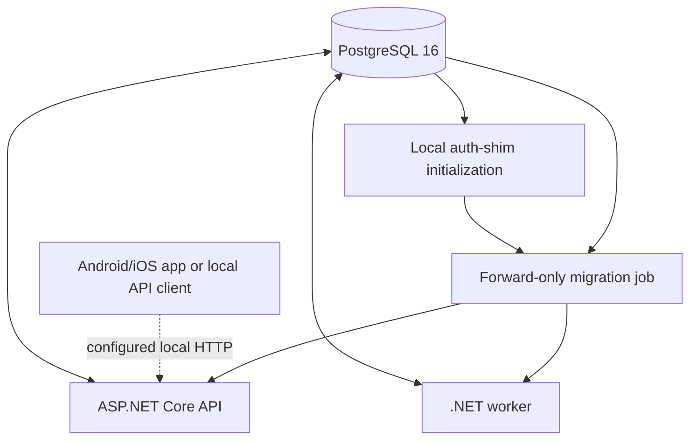

The local database's trust authentication is development-only. Hosted API,
worker, database, managed backups, and production monitoring are not implied by
this topology; see [`../../infra/deployment/README.md`](../../infra/deployment/README.md)
and [`../../infra/monitoring/README.md`](../../infra/monitoring/README.md).

## 4. Student project data model

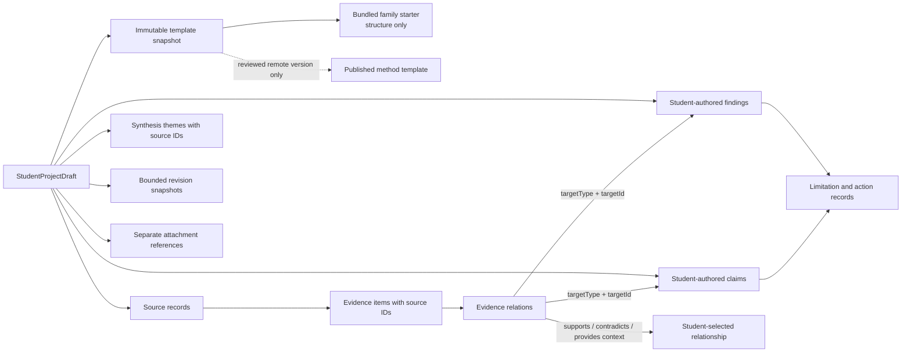

Evidence relations record a student's selected relationship; they do not
automatically judge evidence quality or prove a claim. Attachments remain
separate from evidence until a student creates a note or link explicitly.
The snapshot is either the exact bundled structure-only starter selected by the
student or a separately published remote template. A bundled starter creates a
usable local project outline, but it is not human-reviewed method guidance and
cannot enable Project AI. Neither snapshot contains the student's sources,
observations, findings, or claims.

## 5. System execution sequences

### 5.1 Local project edit and autosave — Current

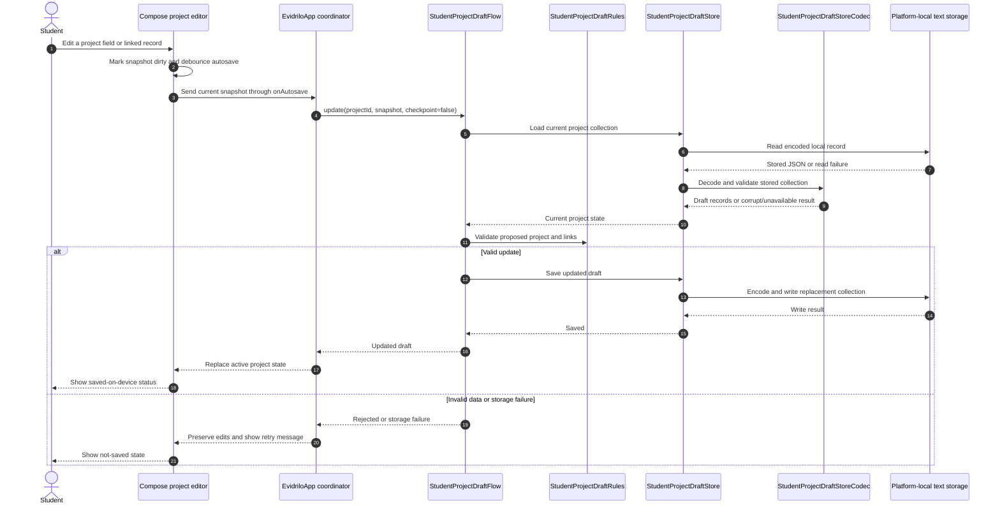

Ordinary autosave updates the working draft without creating a checkpoint for
each keystroke. A meaningful checkpoint is created through the explicit
checkpoint path. A failed write leaves the edits on screen and must not be
reported as saved.

### 5.2 Guided M0 case evaluation — Current

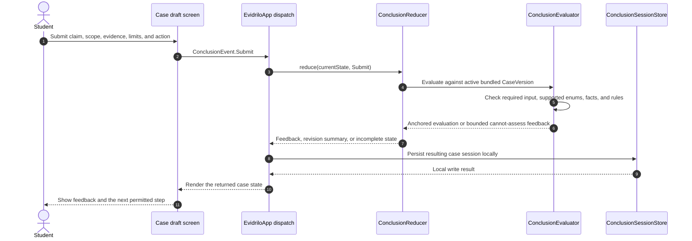

No AI provider or general-purpose model is called to decide M0 case truth. The
evaluator may abstain with `CANNOT_ASSESS` when the active case cannot support a
check. Optional account progress synchronization is a separate, consented
boundary and does not replace this local evaluation.

### 5.3 Server-owned student project API — API exists; mobile integration gated

The server-owned project API is separate from the local project editor. A
client must obtain explicit project-cloud consent before creating or saving
server records. The current mobile project workflow is not wired to these
routes, so this sequence describes the API capability rather than active app
sync.

#### Grant consent and save a project: accepted path

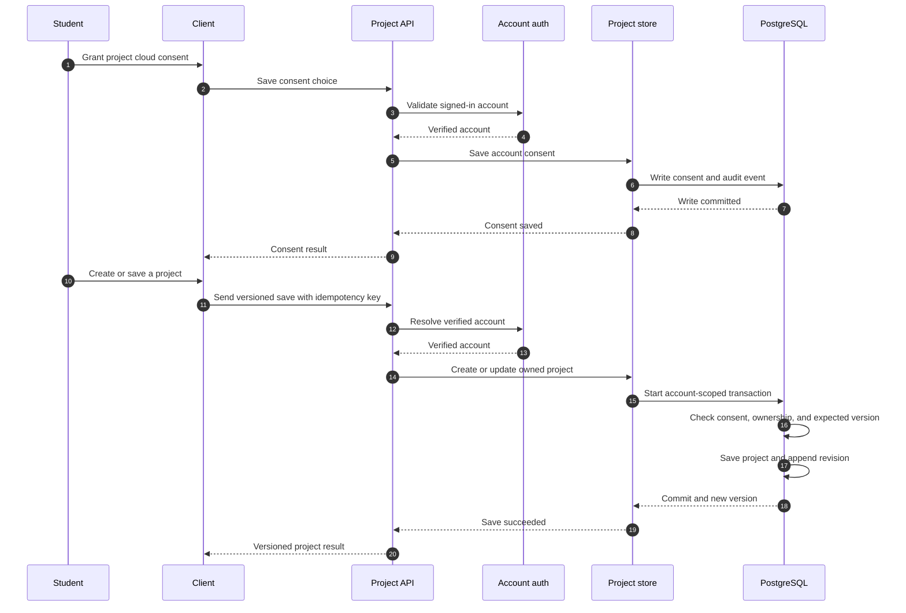

#### Save rejected: consent or ownership conflict

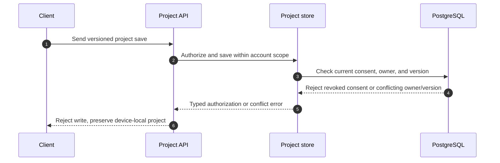

The API routes are `PUT /v1/projects/cloud-consent`, `POST /v1/projects`, and
`PUT /v1/projects/{id}`. The mobile project workflow is not yet connected to
these server-owned records.

This server path does not silently import or merge device-local drafts. A
successful account sign-in is not project consent, and the local project flow
remains usable when this API is unavailable.

### 5.4 Project AI — source-wired, provider and reviewed-template gated

Mobile source includes AI-assisted project scaffolding from a selected
reviewed/published template and stage assistance only where that template
declares supported operations. The student sees the project and stage, chooses
the fields/evidence to share, and reviews an editable proposal before any
project-reducer application. The five bundled structure-only family starters
do not enable method-specific AI. Home's AI entry first offers General Chat or
one eligible Draft/Active project; the project picker includes only a Published
template with a declared AI operation and sends no project list to the provider.
General Chat supports bounded recent conversation (eight turns, 16,000
characters) and an explicitly selected local project snapshot when requested.
Sending requires current account consent. Without a selected project it remains
unlinked; local snapshots are untrusted context, not proof of server ownership. Server activity history is metadata-only. Project history supports
cursor-based older pages; General Chat opens an account activity view that
labels unlinked General entries separately from project-bound metadata.

The API routes and strict-schema Responses adapter are source-wired, but the
provider and General Chat policy remain disabled by default. The project route
verifies the account and current consent, validates idempotency, project owner
binding and revision, bounds the selected context and cost, reserves credits
and provider spend, then rechecks consent/revision before dispatch. It sends
only selected, redacted context. Valid previews settle actual provider token
usage; invalid, stale, rejected, or failed requests release the reservation.
With the current default-off configuration the route returns
`PROJECT_AI_NOT_READY` and does not dispatch to a provider.

#### Default-off request: provider disabled

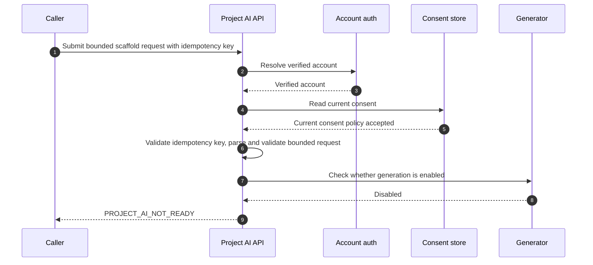

The current disabled path has already read and validated the request body, but
does not look up the template, reserve or consume credits, call an external
provider, or store the submitted text.

#### Gated local request: provider-enabled proposal generation

```mermaid
sequenceDiagram
    autonumber
    participant Caller
    participant UI as Project AI preview
    participant API as Project AI API
    participant Auth as Verified account
    participant Generator as Approved generator
    participant Template as Template store
    participant Consent as Consent store
    participant Credits as Credit ledger
    participant Provider as AI provider

    Caller->>API: Submit bounded request with idempotency key
    API->>Auth: Verify account and email
    Auth-->>API: Verified account
    API->>Consent: Read and validate current Project AI consent
    Consent-->>API: Current consent policy accepted
    API->>API: Parse and validate request, confirm generator enabled
    API->>Template: Load exact published version and validate fields
    Template-->>API: Reviewed compatible template
    API->>Consent: Recheck consent before reserving credits
    Consent-->>API: Still authorized or revoked
    alt Consent still authorized before reservation
        API->>Credits: Estimate maximum cost from bounded tokens and configured rates; reserve up to 200 credits
        Credits-->>API: Request-bound maximum reservation or rejection
        alt Credit reservation succeeded
            API->>Consent: Recheck consent immediately before dispatch
            alt Consent still authorizes dispatch
                Consent-->>API: Dispatch authorized
                API->>API: Redact bounded student fields
                API->>Generator: Generate a structured proposal
                Generator->>Provider: Send redacted context
                Provider-->>Generator: Candidate proposal, provider token usage, or failure
                Generator-->>API: Output and usage, or typed failure
                API->>API: Validate version, field allowlist, size, credentials, and usage; calculate actual charge
                alt Output and usage are valid
                    API->>Credits: Settle actual token charge and release unused reservation
                    Credits-->>API: Preview charge confirmed
                    API-->>UI: Show preview and actual credit cost without changing project
                else Provider fails, output is invalid, or reservation expires
                    API->>Credits: Release reservation
                    Credits-->>API: Reservation released
                    API-->>UI: Typed failure, keep project unchanged
                end
            else Consent revoked before dispatch
                Consent-->>API: Dispatch no longer authorized
                API->>Credits: Release held reservation
                Credits-->>API: Reservation released
                API-->>UI: Consent error, keep project unchanged
            end
        else Credit reservation rejected
            API-->>UI: Insufficient credit or replay error, no provider dispatch
        end
    else Consent revoked before reservation
        Consent-->>API: Consent no longer authorizes request
        API-->>UI: Consent error, no credit reservation or provider dispatch
    end
```

#### Future request: a gate rejects the proposal

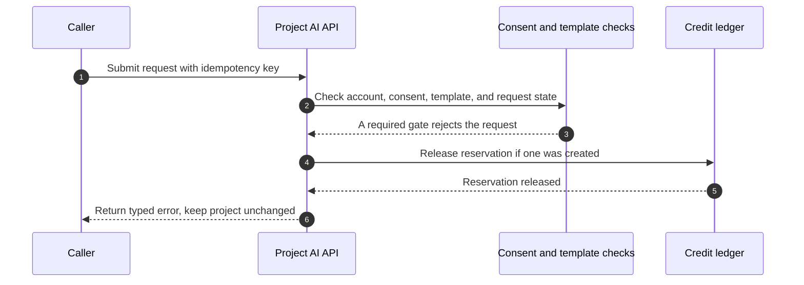

#### Source-wired response: student review and outcome recording

```mermaid
sequenceDiagram
    autonumber
    participant Student
    participant UI as Project AI preview
    participant API as Project AI API

    Student->>UI: Review, edit, apply selected parts, or dismiss
    UI->>API: Record apply/dismiss outcome with request key
    API->>API: Store idempotent preview outcome; do not change the settled charge
    alt Student applies selected parts
        API-->>UI: Outcome recorded; original preview charge unchanged
        UI->>UI: Apply only selected fields
        UI-->>Student: Show updated draft and provenance
    else Student dismisses proposal
        API-->>UI: Dismissal recorded; original preview charge unchanged
        UI-->>Student: Keep project unchanged
    end
```

The diagrams distinguish the default-off request from the locally configured
provider path; neither is a claim of a live runtime. Consent and request
validation precede template lookup; consent and revision are rechecked around
credit reservation and dispatch. A valid preview settles its token-based
charge when generated, while later apply/dismiss recording does not change
that charge. Invalid or stale output is withheld and releases the reservation.
Provider terms/privacy/retention approval, an actually reviewed selectable
template, provider-backed Android acceptance, and human/domain review remain
gates. Generated content remains a proposal, never evidence or evaluator
authority.

### 5.5 RevenueCat purchase and local access — Client path enabled by D-131; provider acceptance gated

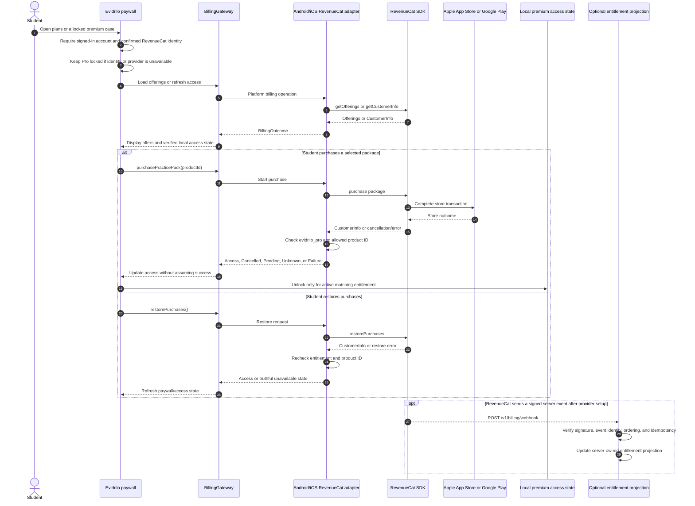

The purchase/restore branch is available independently from local guest mode,
but still requires a signed-in account and working provider configuration.
Only active matching RevenueCat `CustomerInfo` unlocks Pro locally; the server
projection is not the unlock path. Cancelling a purchase leaves access unchanged.
Cancelling renewal keeps
access through the store-reported entitlement period; expiry or revoke removes
Pro benefits while preserving local work. Test Store purchase, restore, revoke,
and expiry still require provider/device evidence.

### 5.6 Template authoring, review, and student catalog — API workflow; dashboard/content gated

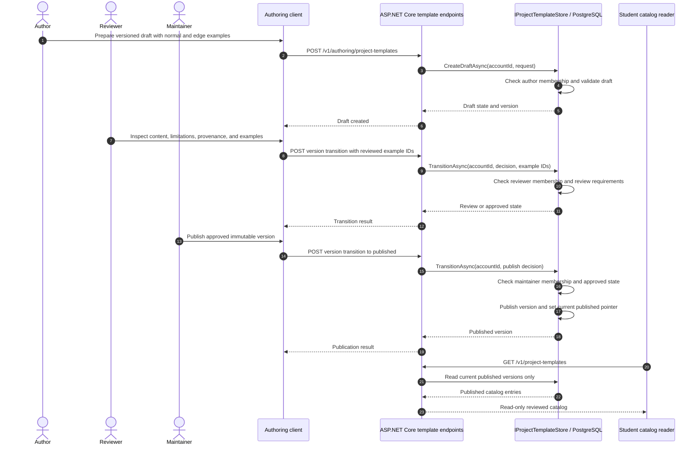

The API authoring endpoints exist, but a developer authoring dashboard and
human/domain review are not established here. No reviewed, student-selectable
template is currently recorded; blank/manual project creation remains the
available route.

### 5.7 `.evproj` export/import — Local device path; device acceptance gated

#### Export a report or `.evproj` archive

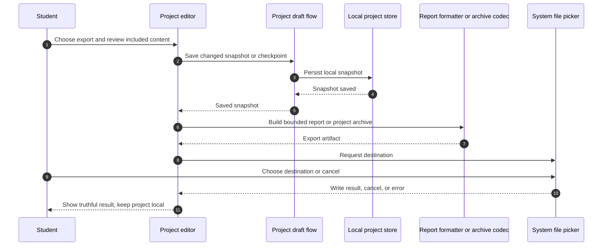

#### Export stopped because the local save failed

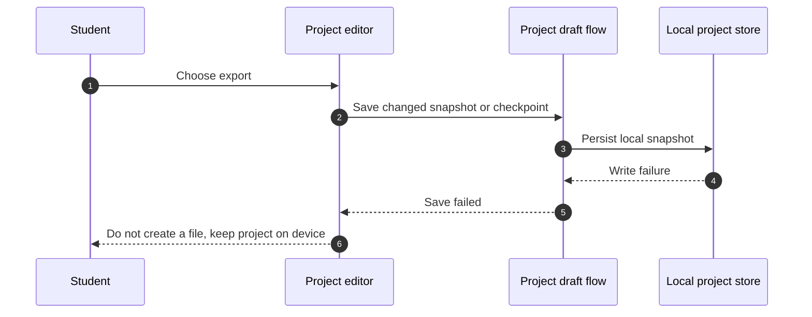

#### Import a `.evproj` archive: preflight and staging

```mermaid
sequenceDiagram
    autonumber
    participant Student
    participant UI as Project editor
    participant Picker as System file picker
    participant Preflight as Archive preflight
    participant Archive as Archive codec

    Student->>Picker: Choose archive
    Picker-->>UI: File bytes and metadata
    UI->>Preflight: Check bounds, manifest, hashes, and records
    alt Archive passes preflight
        Preflight-->>UI: Show import preview
        Student->>UI: Confirm copy or compatible revision restore
        UI->>Archive: Stage validated attachments
        alt Attachment staging succeeds
            Archive-->>UI: Staged attachments
        else Attachment staging fails
            Archive-->>UI: Staging error
            UI-->>Student: Keep project list unchanged; offer retry
        end
    else Archive is invalid or exceeds bounds
        Preflight-->>UI: Reject without changing project list
        UI-->>Student: Show import error
    end
```

#### Import a `.evproj` archive: commit staged data

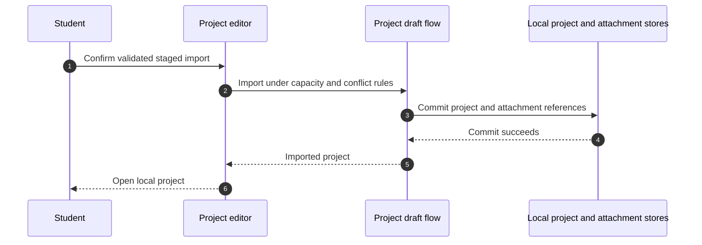

#### Import commit failed: rollback staged data

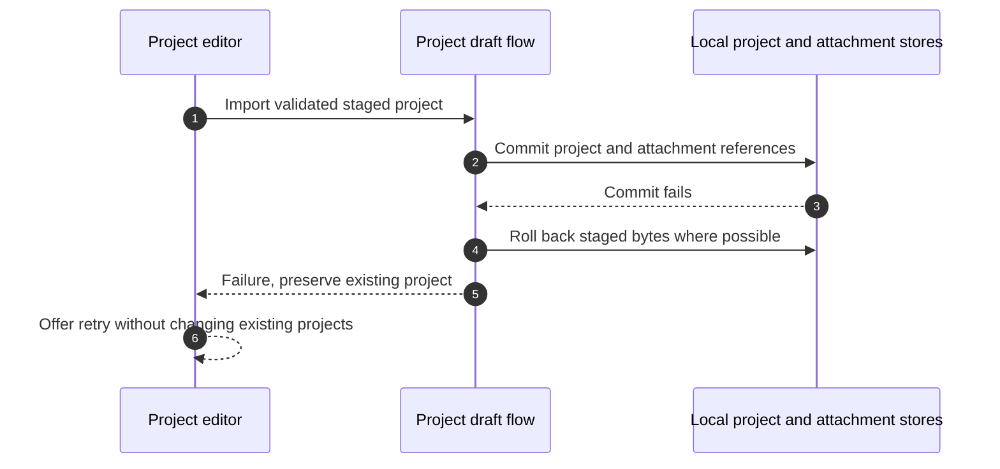

Source and target-compilation checks exist for the platform adapters. Actual
device save/reopen, accessibility, and cleanup acceptance remain open. An
exported file is student-owned; exporting does not create cloud sync.

### 5.8 D-106 case-AI conversation — mobile path source-wired; provider gated

The mobile case-AI client is connected to the authenticated conversation
start/turn/clear routes in source. D-129 pauses this path only when the
temporary guest flag is enabled; the current source constant is false. Each
request still requires a verified signed-in case session and an explicit,
request-level choice to share displayed feedback, claim, and selected
evidence. The provider is disabled by default; successful-response branches
below remain gated paths, not live capabilities.
The client holds a bounded transcript for the active context; the server stores
conversation metadata rather than raw dialogue. `next_action` and unmapped
proposal fields remain preview-only. Supported claim, scope, and limitation
proposals change the draft only after explicit application, and the student must
submit again for a fresh deterministic result.

```mermaid
sequenceDiagram
    autonumber
    actor Student
    participant UI as Case AI panel
    participant App as EvidriloApp
    participant Client as KMP AiGateway
    participant API as AI conversation API
    participant Auth as Verified account
    participant Context as Published case context
    participant Store as Conversation and turn store
    participant Server as AiConversationGateway
    participant Credits as Account credit ledger
    participant Provider as Optional AI provider
    participant Audit as AI audit store
    participant Reducer as ConclusionReducer
    participant Evaluator as ConclusionEvaluator

    alt Temporary guest mode enabled (current)
        Student->>UI: Open case AI
        UI->>App: Request assistance for local case
        App-->>UI: AI paused; no request or context sent
        UI-->>Student: Continue deterministic case work
    else Account-backed AI path enabled
    Student->>UI: Confirm context sharing and submit a question
    UI->>App: Send bounded prompt for the active case
    App->>App: Build case, draft, and evaluation fingerprint
    App->>Client: Start or reuse matching account-scoped session
    Client->>API: POST /v1/ai/conversations
    API->>Auth: Verify signed-in account
    Auth-->>API: Account accepted
    API->>API: Require explicit request opt-in and validate request
    API->>Context: Rehydrate case and validate anchors/fingerprint
    Context-->>API: Context valid
    API->>Store: Create or replay metadata-only session
    Store-->>API: Session result
    API-->>Client: Session result
    Client-->>App: Session result
    App->>Client: Submit bounded turn with request key and per-turn opt-in
    Client->>API: POST /v1/ai/conversations/{id}/turns
    API->>Auth: Recheck signed-in account
    Auth-->>API: Account accepted
    API->>API: Require explicit per-turn opt-in and validate request
    API->>Context: Rebuild context and reject stale identity
    Context-->>API: Valid or stale context
    API->>Store: Reserve idempotent turn slot
    Store-->>API: Turn reservation or typed conflict/limit error
    alt Turn reservation created
        API->>Server: Generate from bounded, redacted prompt
        Server->>Credits: Estimate bounded maximum from configured token rates and reserve it
        alt Credit reservation denied or replayed
            Credits-->>Server: No new reservation
            Server-->>API: Quota or idempotency fallback, do not call provider
        else Credit reserved
            Credits-->>Server: Request-bound reservation
            Server->>Provider: Invoke configured adapter (disabled in current build)
            alt Provider disabled or unavailable
                Provider-->>Server: No generated response or provider failure
                Server->>Credits: Release reserved credit
                Credits-->>Server: Released, no credit consumed
                Server-->>API: Typed fallback, draft unchanged
            else Future approved provider returns a response
                Provider-->>Server: Candidate response, verified token usage, or provider failure
                Server->>Server: Validate purpose, anchors, schema, before-values, and token usage
                alt Response and usage are valid
                    Server->>Credits: Settle actual usage charge and release unused reservation
                    Credits-->>Server: Token-priced settlement succeeded or failed
                    Server-->>API: Validated typed response or settlement fallback
                else Response is invalid or stale
                    Server->>Credits: Release reserved credit
                    Credits-->>Server: Released, no credit consumed
                    Server-->>API: Typed fallback, draft unchanged
                end
            end
        end
        API->>Store: Complete turn as accepted only for a successful response
        Store-->>API: Turn recorded or reservation released
        API->>Audit: Record safe outcome metadata
        API-->>Client: Typed response or error
        Client->>Client: Validate response purpose, session, turn, anchors, and before-values
        Client-->>App: Valid result or bounded failure
        alt Valid typed response
            App-->>UI: Show response or before/after preview, do not auto-apply
            opt Student applies a supported proposal
                Student->>UI: Choose Apply to draft
                UI->>App: Apply proposal
                App->>App: Check field allowlist and current before-value
                App->>Reducer: ConclusionEvent.UpdateDraft
                Reducer-->>App: Updated learner draft
                App-->>UI: Draft changed, not yet re-evaluated
                Student->>UI: Submit the revised draft
                UI->>Reducer: ConclusionEvent.Submit
                Reducer->>Evaluator: Re-evaluate the active case deterministically
                Evaluator-->>Reducer: New bounded case feedback
            end
        else Provider unavailable, rejected output, quota, replay, or turn error
            App-->>UI: Keep the draft and case result unchanged
        end
    else Turn replayed, in progress, stale, or over limit
        API-->>Client: Typed API error, do not generate
        Client-->>App: Bounded failure
        App-->>UI: Keep the draft and case result unchanged
    end
    opt Student clears a completed conversation
        UI->>App: Clear completed chat (control is hidden during an active request)
        App->>UI: Clear local transcript and detach local session immediately
        App->>Client: Request server conversation clear
        Client->>API: DELETE /v1/ai/conversations/{sessionId}
        API->>Auth: Verify signed-in account
        Auth-->>API: Account accepted
        API->>Store: Clear only this account's session and turn metadata
        Store-->>API: Cleared, absent, in-progress, or error
        API-->>Client: Clear result
        Client-->>App: Clear result
        App->>Client: Refresh account credit balance
        Client->>API: GET /v1/ai/credits
        API->>Credits: Read account balance
        Credits-->>API: Current balance
        API-->>Client: Balance result
        Client-->>App: Balance or refresh failure
        App-->>UI: Show ready/unavailable state, keep local transcript cleared
        opt Server deletion is unconfirmed
            UI-->>Student: Report that metadata may remain until expiry
            opt Retry is allowed
                Student->>UI: Retry server clear
                UI->>App: Retry with the same session and account
            end
        end
    end
    end
```

The case-AI reducer path is not the student-project reducer path. Mobile source,
focused tests, and Android compilation are verified; provider operation,
device interaction, accessibility, iOS runtime, and human usefulness remain
open. A dismiss or unsupported
proposal leaves the draft unchanged. The current Clear action removes the local
transcript immediately and requests server metadata deletion separately. If
deletion is unconfirmed, the UI reports it and offers a same-session retry when
retryable; the server's 30-minute session expiry is the fallback cleanup bound.

### 5.9 Remove an attachment from the current project revision — Current source; device acceptance gated

Attachment removal is a revision change, not an instruction to erase every
stored copy. The editor saves pending changes first, asks for confirmation, and
removes the attachment reference only from the new current checkpoint. Older
revision snapshots keep their references; physical bytes are removed only when
no retained revision refers to them.

```mermaid
sequenceDiagram
    autonumber
    actor Student
    participant UI as Project editor
    participant Flow as StudentProjectDraftFlow
    participant Projects as Local project store
    participant Files as Attachment store and deletion fence

    Student->>UI: Choose Remove attachment
    UI->>Student: Confirm removal from the current project revision
    alt Student cancels
        Student-->>UI: Cancel
        UI-->>Student: Keep project metadata and file unchanged
    else Student confirms
        UI->>Flow: Save dirty project edits
        Flow->>Projects: Persist current working snapshot
        Projects-->>Flow: Saved or failure
        alt Save failed
            Flow-->>UI: Stop removal
            UI-->>Student: Keep attachment and project unchanged
        else Current snapshot saved
            UI->>Flow: removeAttachment(projectId, attachmentId)
            Flow->>Projects: Load current project and revision history
            Projects-->>Flow: Current project state
            Flow->>Files: Prepare per-attachment deletion fence
            Files-->>Flow: Fence prepared or failure
            Flow->>Projects: Save new checkpoint without current attachment reference
            Projects-->>Flow: Checkpoint saved or failure
            alt Checkpoint failed
                Flow->>Files: Cancel fence or recover using saved references
                Files-->>Flow: Attachment retained or recovery pending
                Flow-->>UI: Return save failure
                UI-->>Student: Keep current attachment and report recovery state
            else Checkpoint saved
                Flow->>Files: Reconcile file against current and historical references
                alt Earlier revision still references file
                    Files-->>Flow: Retain file bytes for revision history
                else No retained revision references file
                    Files->>Files: Remove bytes from private local storage
                    Files-->>Flow: Cleanup result
                end
                Flow-->>UI: Updated project and cleanup status
                UI-->>Student: Show removal result without rewriting older revisions
            end
        end
    end
```

Local flow tests cover checkpoint failure, recovery, and historical reference
retention. Android/iOS device cleanup, persistence, and accessibility remain
separate acceptance gates.

## 6. Related product journeys

The following diagrams stay in the product workflow guide because they describe
student choices rather than internal request/response details:

- app entry, sign-in gates, and return destinations;
- local project lifecycle, archive, Trash, and revision restore;
- M0 case practice and evidence-change challenge;
- contextual D-106 case AI versus the gated D-119 project/general AI target;
- profile, settings, account, support, and history;
- optional local reminders.

See [`../product/workflows.md`](../product/workflows.md) for those journeys and
their Current/Gated/Target labels. For API route schemas, see
[`../api/README.md`](../api/README.md); for verification boundaries, see
[`../testing.md`](../testing.md) and [`../release.md`](../release.md).
